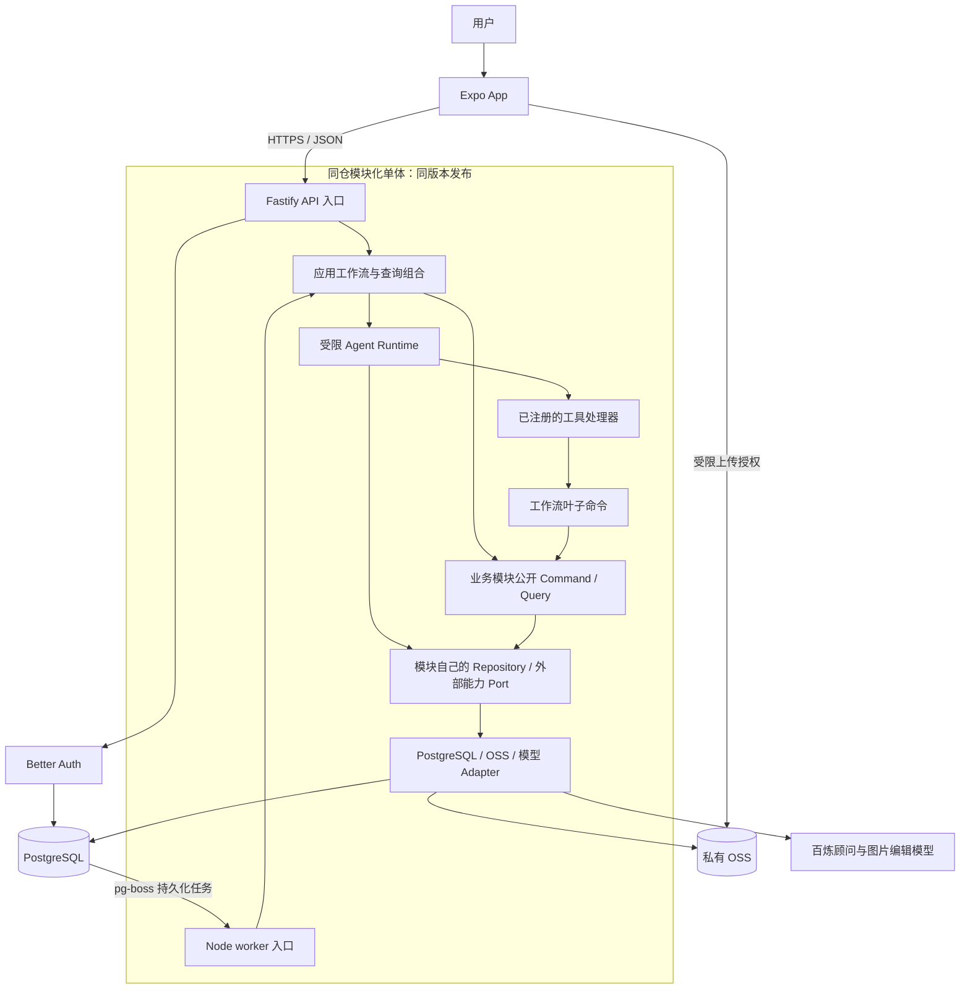
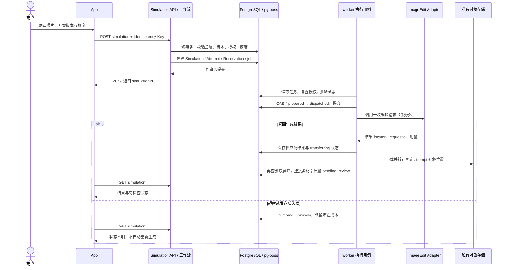
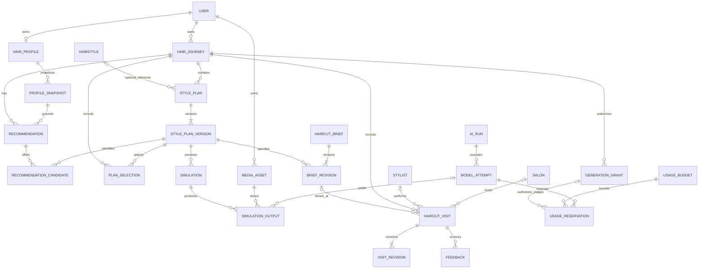

# HairMate ARCHITECTURE

版本：1.0.0 · 日期：2026-09-13 · 状态：供工程实施使用的架构基线，尚未实现代码。

产品依据：[HairMate 产品文档 v1.0.0](./2026-09-12-hairmate-product-v1.0.0-design.md)。产品文档规定“做什么”；本文规定“如何组织与实现”。冲突时先遵守产品范围，不通过架构决定偷偷新增功能。

标记含义：

- **[MVP]**：当前开发必须实现，不表示仓库中已经实现。
- **[Reserved]**：现在明确接口语义、归属或替换位置；没有当前消费者时，只保留本文中的约定，不创建空服务、表、SDK、路由或工具。
- **[Future]**：没有本阶段实现授权，满足产品批准及技术触发条件后再设计。

本文采用模块化单体、一个 PostgreSQL、独立 API 与 worker 进程。只为当前耗时生成及清理建立同库持久化任务，不建立通用消息平台、微服务或动态插件平台。

## 1. ARCHITECTURE Goals

### 1.1 MVP 目标与硬约束

**[MVP]** 支撑同一用户跨天完成：照片与需求确认 → 可解释推荐 → 有效基准模拟与原图比较 → 确认方案和 Haircut Brief → 实际理发及现场约定 → 剪后与首次自行打理反馈。

1. App 优先：Expo + React Native + TypeScript + Expo Router；首批用户以中国大陆访问为主。
2. 保留已确认的单一顾问 Agent；权限、额度、业务规则和状态变更由确定性代码执行。
3. 模拟及 Brief 引用具体方案版本；原计划、现场约定和实际结果不得相互覆盖。
4. App 关闭不终止已提交的服务端图片任务；重新打开可续接，而非重新生成。
5. 用户照片与个人记录默认私有；原始事实、用户自报、模型推测与核验信息分别记录。
6. 允许失败后降级继续，但降级路径不冒充完整 Golden Path；满意度与完成率分别评价。
7. 当前仓库没有应用实现。目录、接口及命令是后续开发约定，不是已通过的构建或测试报告。

### 1.2 演进目标

**[Reserved]** 真实生活照片的发型编辑模式、更多 Provider、地图和通知边界。真实生活场景必须使用用户提供的真实照片；具体需求仍待细化，不固定推迟至某一版本。

**[Future]** 经授权历史数据支持的理发师匹配、按需 Web 入口、必要时拆分高负载执行进程。支付、预约等仍不在产品范围；本文只说明未来若批准应放在哪里，不构成路线图承诺。

可演进不等于零修改：新增能力允许修改所属模块和组合入口，但不应迫使所有模块了解新供应商、修改历史事实或重复实现权限规则。

### 1.3 当前技术决定与未决事项

| 层 | 本文采用的开发基线 | 为什么现在这样选 |
| --- | --- | --- |
| App | Expo / React Native / TypeScript / Expo Router | 直接验证手机拍照、现场出示和跨天使用 |
| API / worker | Node.js、Fastify API、独立 Node worker | 单语言、部署边界简单，耗时任务不占据交互请求生命周期 |
| 组织 | pnpm workspace，同仓库、同版本发布的模块化单体 | 共享契约但不共享隐式状态，无需多仓库与服务发现 |
| 数据 | PostgreSQL、node-postgres 驱动、Drizzle 作为 Repository 实现与迁移工具 | 支持关系、短事务和类型化 SQL；ORM 不进入领域接口 |
| 校验 | Zod 作为可序列化契约来源；导出 JSON Schema 供 HTTP / 工具边界使用 | 避免客户端、API、工具各维护一份不同字段定义 |
| AI | AI SDK 在 Adapter / Runtime 边缘使用，百炼候选直连 | 保留单顾问和工具循环，不绑定海外网关 |
| 任务 | pg-boss，复用业务 PostgreSQL | 当前图片任务需要持久化；不额外部署 Redis / RabbitMQ / Kafka |
| 认证 | Better Auth 自托管及 Expo 集成 | 不自制密码和会话协议；身份供应商与业务 User 隔离 |
| 存储 / 部署 | OSS 私有 Bucket；国内 ECS + Docker Compose、RDS 初选 | API 和 worker 可同机独立进程，托管有状态存储，控制运维量 |
| 测试 | 服务端 Vitest；App jest-expo；真实 PostgreSQL 集成测试 | 单元、事务及原生环境问题分别验证 |

这些是架构开发选择，不代表已开通供应商服务。初始化时锁定互相兼容的稳定版本及 lockfile；不在本文承诺某个浮动 `latest` 可重复构建。Drizzle 的事务和迁移能力见 [事务文档](https://orm.drizzle.team/docs/transactions)、[迁移文档](https://orm.drizzle.team/docs/migrations)。

首批 iOS / Android 设备范围、正式登录方式、真实生成额度、供应商账号与模型效果仍需验证。代码可先使用本地 Fake Adapter 完成确定性链路；这些未决项不能成为伪造真实 API、照片效果或成功验收的理由。

## 2. System Overview

### 2.1 部署视图



API 与 worker 是同一应用的两个入口，不是两个自治微服务；共享领域实现与契约，不相互通过内部 HTTP 调用。数据库中 pg-boss 的执行状态不是产品业务状态的权威来源。

### 2.2 逻辑分层与依赖规则

调用层次：**入口 → 应用工作流 → 业务模块公开接口 → 模块私有规则 / Port → Adapter**。

代码依赖方向与运行调用方向不同：Adapter 实现领域定义的 Port，因此依赖向业务接口收敛；领域代码不导入供应商 SDK。

**[MVP] 依赖规则必须由 lint / 架构测试落实：**

1. `mobile` 仅导入客户端契约、API client 和客户端纯逻辑，不导入 `server`、ORM、Provider SDK 或 Secret 配置。
2. 业务模块默认不导入其他业务模块的实现。跨模块调用由 `workflows` 显式组合，仅使用各模块 `public.ts` 暴露的 Command / Query 与只读 DTO。
3. 禁止跨模块直接取得 Repository、导入内部表定义或修改内部状态；实体外键不构成代码反向依赖的理由。
4. `domain` / `application` 不导入 Fastify、Drizzle、pg-boss、OSS 或 AI SDK；需要的能力用窄 Port 注入。
5. 组合入口显式创建实例并传递依赖，不建设 DI 容器、全局 Service Locator 或可写全局单例。
6. `contracts` 只放公开 DTO、Schema、错误码与标识，不放服务端实体、数据库行类型和“通用业务 Service”。
7. Runtime 只依赖工具处理器接口；工具处理器在组合入口绑定叶子业务命令。工具不得回调“开始一次顾问会话”的顶层工作流，避免递归 Agent 循环。
8. 模块通信使用同进程显式调用；不为隐藏循环依赖而改用事件总线。

## 3. MODULE Design

以下模块是业务能力边界，不是部署单元，也不要求每个模块独立 workspace package。外部只能通过公开接口访问；内部可从少量文件起步，不为凑目录提前建空类。

### 3.1 Identity & Access — `identity`

| 项目 | 定义 |
| --- | --- |
| Responsibility | 用户身份映射、账号状态、授权用途、会话校验入口、账号删除屏障 |
| Boundary | 认证交给 Better Auth；业务 User 不等同认证库内部对象。不负责发型选择或历程完成判定 |
| Input / Output | 可信会话 → `ActorContext`；用户授权动作 → 不可由 LLM 伪造的 Consent 记录 |
| Data Ownership | `User`、认证身份映射、`ConsentRecord`、账号停用 / 删除请求及协调检查点；认证表仅由认证实现维护 |
| Dependencies | 自有 Repository、AuthPort；采用邮件登录 / 找回时使用 AuthMailPort |
| MVP Scope | [MVP] 个人账号、所有权隔离、用途授权、删除入口；登录方式按产品未决项落实 |
| Extension Points | [Reserved] 替换身份供应商；[Future] 商家 / 理发师身份需要新角色需求，不能现在加后台权限体系 |

### 3.2 Hair Profile — `profiles`

| 项目 | 定义 |
| --- | --- |
| Responsibility | 头发条件、偏好、信息来源及不可变档案快照 |
| Boundary | 当前偏好与历史依据分离；模型推测不能覆盖用户确认事实 |
| Input / Output | 用户字段及明确确认 → Profile；当前 Profile → `ProfileSnapshot` |
| Data Ownership | `HairProfile`、`HairProfileSnapshot`、字段来源 / 确认时间；只引用 MediaAsset ID |
| Dependencies | 自有 Repository、纯字段校验；素材和身份事实由工作流检查后传入 |
| MVP Scope | [MVP] 渐进收集、确认、版本快照、明确的长期偏好更新 |
| Extension Points | 新字段 / 来源通过 Schema 演进；[Future] 自动学习偏好仍须单独产品批准，不能用评分隐式触发 |

### 3.3 Hair Journey — `journeys`

| 项目 | 定义 |
| --- | --- |
| Responsibility | 本次目标、生命周期、方案选择、步骤证据与完成口径 |
| Boundary | 不拥有方案、图片、Brief 或理发反馈；不让其他模块直接更新 `journey.status` |
| Input / Output | 创建 / 选择 / 关闭命令与已核实证据 → Journey、进度与 GoldenPathAssessment |
| Data Ownership | `HairJourney`、`PlanSelection`、比较 / 取得材料等 `JourneyEvidence`、试点参与记录、历程删除请求及协调检查点 |
| Dependencies | 自有 Repository、纯 `GoldenPathPolicy`；工作流提供其他模块的只读事实 |
| MVP Scope | [MVP] 跨会话继续、明确版本选择、完整 / 降级路径区分、五人试点统计口径 |
| Extension Points | 进度投影和证据类型可扩展；不使用可配置工作流引擎或万能状态字段承载未来功能 |

### 3.4 Styling — `styling`

| 项目 | 定义 |
| --- | --- |
| Responsibility | 有来源的通用发型资料、推荐轮次、个性方案和不可变版本 |
| Boundary | `Hairstyle` 与 `StylePlan` 分开；模块验证和保存候选，不把 LLM 文本当作可执行事实 |
| Input / Output | 档案快照、参考与模型草稿 → 已校验 Recommendation / StylePlanVersion；查询 → 只读候选 DTO |
| Data Ownership | `Hairstyle`、`Recommendation`、候选关联、`StylePlan`、`StylePlanVersion` |
| Dependencies | 自有 Repository、纯硬约束校验；所需快照和模型输出由工作流传入 |
| MVP Scope | [MVP] 可追溯资料、候选解释、冲突 / 未知状态、方案版本；初期资料以受审查种子数据维护，无内容后台 |
| Extension Points | 内部 `catalog` 与 `plans` 职责分开；资料规模确实增长时可拆内容模块；不先建爬虫、向量库或推荐平台 |

### 3.5 Simulation — `simulations`

| 项目 | 定义 |
| --- | --- |
| Responsibility | 模拟的业务请求、输入与方案绑定、输出选择、质量判断 |
| Boundary | 不直接调用模型 SDK、扣改授权额度或写 OSS；供应商成功与质量合格分开 |
| Input / Output | 方案版本、素材、模拟模式、有效授权引用 → Simulation；执行结果 → 质量待检查的输出 |
| Data Ownership | `Simulation`、`SimulationInput`、`SimulationOutput`、`SimulationQualityReview`；引用执行 Attempt |
| Dependencies | 自有 Repository、`SimulationPolicy`；由工作流协调 ai-operations 和 media |
| MVP Scope | [MVP] 仅 `baseline` 模式、同条件比较、拒绝坏图、有界再尝试、跳过后的降级标记 |
| Extension Points | [Reserved] `real_photo_scene` 输入策略；只有规格批准后才增加模板 / UI / 校验，不预先启用 |

### 3.6 Haircut Brief — `briefs`

| 项目 | 定义 |
| --- | --- |
| Responsibility | 结构化交付内容、修订、用户确认和可导出表示 |
| Boundary | 不是聊天记录副本；不覆盖已确认版本，不生成虚假精度或操作配方 |
| Input / Output | 明确方案版本、已核实事实和草稿 → BriefRevision；确认 → 不可变交付；查询 → BriefView DTO |
| Data Ownership | `HaircutBrief`、`BriefRevision`、确认记录及选定的素材关联 |
| Dependencies | 自有 Repository、纯 Brief 校验 / 渲染模型；工作流提供方案和素材事实 |
| MVP Scope | [MVP] 摘要、分区要求、硬限制、维护及现场核实项；App 查看、离线保存 / 导出 |
| Extension Points | 渲染格式通过 `BriefRenderer` 替换；[Future] 理发师协同批注另设授权，不回写历史交付 |

### 3.7 Haircut Records & Reflection — `haircuts`

| 项目 | 定义 |
| --- | --- |
| Responsibility | 实际理发、现场约定、执行事实、剪后与首次自行打理反馈、私有执行者记录 |
| Boundary | 不预约、不交易、不排名；Stylist 是人、Salon 是门店，二者不合并 |
| Input / Output | 用户自报理发和反馈 → Visit / Feedback；查询 → 按原目标、现场约定、实际结果组织的复盘事实 |
| Data Ownership | `HaircutVisit`、`VisitRevision` 中的约定 / 执行事实、`Feedback` 及修订、私有 `Stylist` / `Salon` 记录 |
| Dependencies | 自有 Repository；工作流传入已出示 Brief 的不可变引用与摘要 |
| MVP Scope | [MVP] 允许未知执行者，标明代录来源，保留当时个人 / 门店快照；维护反馈与满意度分开 |
| Extension Points | [Future] 独立匹配模块消费授权后的只读数据；可附 canonicalRef，但不覆盖自报历史或自动合并同名 |

### 3.8 Media — `media`

| 项目 | 定义 |
| --- | --- |
| Responsibility | 上传授权、素材校验、私有访问、生成结果导入、删除与清理状态 |
| Boundary | 业务模块仅持有 Asset ID；外部不得直接获得永久对象 key 并调用存储；签名链接不是实体 ID |
| Input / Output | 上传申请 → 受限上传凭据；确认上传 → 可用 Asset；授权读取 → 短时链接；删除 → 清理状态 |
| Data Ownership | `MediaAsset`、`AssetUsage`、上传状态、对象位置、素材删除任务及检查点；不拥有账号 / 历程的跨模块删除进度 |
| Dependencies | 自有 Repository、ObjectStoragePort、受限 ProviderResultFetcher；无任意 URL 抓取器 |
| MVP Scope | [MVP] 原照 / 参考 / 模拟 / 剪后图的访问、校验、生命周期；导出副本能力边界说明 |
| Extension Points | 更换对象存储只改 Adapter 和迁移工具；未来格式校验按素材用途增加，不扩大默认访问权限 |

### 3.9 Consultation — `consultations`

| 项目 | 定义 |
| --- | --- |
| Responsibility | 顾问对话记录、用户表达、提议和运行关联 |
| Boundary | 不是业务数据的第二份真相；聊天摘要不能覆盖结构化档案、方案或授权 |
| Input / Output | 用户消息 → ConsultationTurn；运行结果 → AssistantMessage / DraftProposal / 需用户确认的事项 |
| Data Ownership | `Consultation`、`Message`、`DraftProposal`、上下文摘要与原始消息范围；引用 AiRun |
| Dependencies | 自有 Repository；推理和工具循环由上层 Runtime 调度，模块不反向调用工作流 |
| MVP Scope | [MVP] 单用户、单顾问、历程内对话；运行中断和跨会话恢复展示 |
| Extension Points | 新任务 Prompt 不等于新 Agent；[Future] 群聊、理发师聊天、动态技能市场不实现 |

### 3.10 AI Operations — `ai-operations`

| 项目 | 定义 |
| --- | --- |
| Responsibility | AI 运行 / 外部调用事实、授权范围、额度预留、尝试状态和成本核对 |
| Boundary | 只接受可信用户确认的授权；不做钱包、充值、订单、支付或发型业务判定 |
| Input / Output | 已确认授权 → GenerationGrant；运行申请 → AiRun / Attempt / Reservation；执行事实 → 标准化结果 |
| Data Ownership | `AiRun`、`ModelAttempt`、`GenerationGrant`、`UsageBudget`、`UsageReservation`、`UsageRecord`、有限审计记录 |
| Dependencies | 自有 Repository、纯预算 / 尝试状态规则；模型 Port 由 Runtime / 执行工作流调用，结果回到公开命令 |
| MVP Scope | [MVP] 顾问和图片调用都受限；持久化尝试，不明结果保守计入风险；禁用隐式生成重发 |
| Extension Points | 新模型能力通过 Adapter；[Future] 多供应商自动路由或复杂成本平台另行评估 |

### 3.11 应用协调与基础设施（不新增业务域）

- **[MVP] `workflows`**：创建历程、推荐提交、模拟申请、交付确认、理发记录、删除等跨模块用例；不直接写表。跨模块读写通过公开接口，同库必要原子性通过 `TransactionContext` 协调。
- **[MVP] `ai-runtime`**：单一顾问有界循环、上下文拼装、工具调度；使用 ai-operations 保存运行状态。具体业务确认规则不在这里重写。
- **[MVP] `infrastructure`**：连接池、事务绑定、任务驱动、日志、时钟、配置和供应商实现；不能成为隐藏全部业务规则的 `utils` 目录。

## 4. Core Flows

### 4.1 创建历程与推荐

1. App 通过认证，`CreateJourney` 创建 `active` 历程。用户上传照片，Media 校验通过后才成为可引用输入。
2. 用户确认关键条件；`CaptureProfileSnapshot` 固化本轮依据。未确认项目仍为 unknown / inferred，不默认满足。
3. `StartConsultationTurn` 保存用户消息与 AiRun，在短事务内入队并返回 `202`。App 查询运行状态；V1 不依赖 WebSocket 或流式 UI。
4. worker 的 `RunConsultationTurn` 构造最小上下文，调用 Runtime。LLM 只能提出候选或工具动作。
5. 工具经过校验，调用叶子用例；候选由 Styling 检查硬约束、来源、快照和字段后保存为草稿 / 推荐结果。
6. 用户选择要模拟的具体候选版本及额度。候选产生不等于已经选择或授权生成。

**为什么当前顾问轮次也可后台运行：**复用已有任务驱动，不再构建单独的长连接恢复机制；轮次完成后一次性展示结果即可支持 MVP。中断的轮次保留已落库草稿，不能因重连重复执行付费工具。

### 4.2 基准模拟的提交与执行



提交原子操作由同一 PostgreSQL 事务覆盖：业务幂等记录、Simulation、Attempt、额度预留、pg-boss job。Adapter 必须将当前事务传给 pg-boss，例如 `fromDrizzle(tx, sql)`；相同连接串不等于相同事务。实现及回滚语义见 [pg-boss 事务适配](https://pgboss.io/api/adapters)。不另建 outbox，也不在数据库事务中等待模型或 OSS。

### 4.3 方案确认、Brief 与现场使用

1. 用户比较通过质量检查的基准图与原照；`RecordComparison` 记录原照、输出、方案版本和用户动作。
2. `SelectPlan` 校验版本、所属历程及当前修订号，保存选择。更改选择会使旧材料相对当前选择失效，但不修改旧材料。
3. `DraftBrief` 基于该版本生成草稿；Brief 模块校验结构、硬限制、来源和现场待核实项。
4. 用户通过独立 API 确认具体 BriefRevision。此操作不能由 Agent 工具代替。
5. App 获取只含已选择材料的 `BriefView`。**[MVP] 导出基线为本地 PDF**：固定模板、转义文字、已授权图片本地化，使用 Expo Print / Sharing；不部署服务端浏览器渲染集群。原生实现参考 [Expo Print](https://docs.expo.dev/versions/latest/sdk/print/)、[Sharing](https://docs.expo.dev/versions/latest/sdk/sharing/)。
6. 用户实际取得 / 保存成功后记录交付证据；不能仅凭 API 返回 200 就认定用户已获得材料。材料标注版本、生成时间及模拟示意属性，可在无网络时现场出示。
7. 理发后记录实际出示的 BriefRevision、原目标、现场约定、实际执行和个人 / 门店快照；允许自报，不包装为理发师平台核验。

### 4.4 复盘与闭环评价

`RecordFeedback` 保存 `after_cut` 和 `after_self_styling` 两类反馈；纠正产生修订，不静默覆盖当时表达。`AssessJourney` 从各模块公开查询取得证据，按 `GoldenPathPolicy` 计算完整、降级或未完成。

完整闭环必须对应一个明确的 `visitId`：其实际出示的 `shownBriefRevisionId` 已由用户确认且取得，两类反馈都属于该次 Visit，体验时间不得早于此次理发。不得拼接 Visit A 的材料出示与 Visit B 的反馈来计成功。评估保存所用 Visit / Brief / Feedback 修订引用和 policyVersion；后续纠正产生新评估，不改写原评估依据。

满意度不是完成前置条件，首次自行打理反馈才是完整路径的必要证据。Agent 可以起草复盘建议；写入长期偏好仍调用独立的用户确认命令。五人、各 28 天、至少三人完整完成及至少两人具体受益且打理满意 ≥4/5 的试点目标沿用产品文档，不由架构扩大样本或更换指标。

### 4.5 删除与晚到结果

`RequestDeletion` 先由所属模块设置删除屏障，再同事务安排清理任务并返回 `202`。新签名、生成和挂接被拒绝；worker 在派发前及挂接结果前复查。OSS 删除可重试；外部生成已发送则不承诺撤销或免计费。晚到对象不挂接为可用素材，进入幂等清理；具体保留与恢复见第 5、9 节。

账号删除请求 / 协调检查点归 Identity，历程删除归 Journey，单张素材删除归 Media。上层删除工作流推进各模块公开清理命令；pg-boss 只拥有执行元数据。跨库恢复所需的最小删除清单由 infrastructure 写入独立于业务数据库回滚的私有运维存储，不让 Media 变成通用删除平台。

## 5. Data ARCHITECTURE

### 5.1 持久化与关系

**[MVP]** 一个 PostgreSQL；业务表按模块前缀或 schema 组织，迁移集中排序。Better Auth 与 pg-boss 表单独命名空间管理。图片字节保存在 OSS；数据库仅保存对象定位、用途、版本及授权关系，不保存长期可公开访问的 URL。



图中省略通用 owner 外键、素材输入关联与会话消息，避免误以为这些关系不需要校验。`HaircutVisit` 可记录未使用 Brief 的降级经历，因此引用允许为空；完整 Golden Path 必须有出示已确认 Brief 的证据。

### 5.2 核心字段与约束

| 实体 / 对象 | 关键字段与不变量 |
| --- | --- |
| User / ConsentRecord | 业务 userId、认证 identityRef、accountState；用途、范围、用户动作、时间、撤销状态 |
| HairProfile / Snapshot | 当前字段携带 `value/source/confirmedAt`；Snapshot 的数据和 `schemaVersion` 不变 |
| HairJourney | ownerId、goal、lifecycle、revision、currentSelectionId、删除状态；不包含支付 / 推荐分数 |
| Hairstyle | sourceRef、可用来源说明、通用形态及适用条件；不混入个人偏好 |
| StylePlan / Version | 稳定 planId；每个 versionId 含 ownerId、journeyId、版本号、profileSnapshotId、结构化内容及来源 |
| Recommendation | profileSnapshotId、aiRunId、候选 versionId 关联、理由 / 冲突 / 未知；不只引用当前 Profile |
| Simulation | ownerId、journeyId、planVersionId、mode、currentRunId、currentAttemptId、executionStatus；输入 Asset 关联不可静默替换 |
| SimulationOutput / Review | assetId、attemptId、qualityStatus、审查人 / 来源、失败理由、时间；不把 HTTP 成功设成 accepted |
| Brief / Revision | stable briefId、具体 planVersionId、contentSchemaVersion、材料列表、确认人 / 时间及 supersedesId |
| HaircutVisit / VisitRevision | 稳定 visitId 与 currentRevision；修订保存 shownBriefRevisionId、briefShown、自报日期、原目标 / 现场约定 / 执行、个人门店快照、操作者 / 来源 / 时间 / supersedesId |
| Feedback / Revision | visitId、kind、实际体验时间、记录时间、评分及具体反馈、来源；更新保留修订关系 |
| Stylist / Salon | 私有 ownerId、名称、自报来源；实体独立，同名不自动合并；未知允许缺失 |
| MediaAsset / AssetUsage | ownerId、purpose、storageLocator、checksum、MIME、尺寸、lifecycle；引用处只存 assetId，不复制图片字节 |
| Consultation / Message | ownerId、journeyId、role、content、source、关联 runId；用户消息与模型生成不可互相冒充 |
| AiRun / ModelAttempt | 操作类型、输入快照引用、模型 / Prompt / Tool / Policy 版本、状态、时间、requestId、输出引用和标准化错误 |
| GenerationGrant | 确认用户、journeyId、允许 planVersionId / assetId / mode、张数 / 成本上限、有效期、撤销及版本 |
| UsageBudget | 固定 scopeType（service_period / owner_period / advisor_run / image_grant）、scopeId、dimension（cost / image_count）、limit / reserved / settled、计价单位与版本；不是钱包 |
| UsageReservation / UsageRecord | attemptId、budgetId、图片时必需的 grantId、计费单位、货币、最大预留 / 结算、依据 `actual/estimated/unknown`；不是付款记录 |
| JourneyEvidence / PilotEnrollment | 比较、取得 Brief、用户动作及版本引用；试点固定参与组、观察开始 / 截止、结论及缺失原因 |

数据库约束与业务校验共同执行：

- `UNIQUE(plan_id, version_no)`、`UNIQUE(brief_id, revision_no)`；不可变内容不原地更新。
- `UNIQUE(attempt_id, budget_id)` 防止重复预留；budgetId 已唯一对应作用域及维度。同一调用可以占用多个限额，但只有一份调用用量 / 结算事实，不多次计费。
- 对个人数据使用可验证的 `(owner_id, journey_id, id)` 关联约束；不能仅因 UUID 存在就允许跨用户 / 跨历程引用。
- 幂等记录唯一键为 `(actor_id, operation, idempotency_key)`；存规范化请求摘要。相同键相同摘要返回同一资源，不同摘要返回 409。
- 可变聚合用整数 `revision` 做条件更新。版本冲突返回 409，不能以最后写入覆盖另一个设备已确认的选择。
- 金额按最小精度单位的整数 / 精确 decimal 保存，并携带 currency / 计价依据；不使用浮点数累计预算。
- 时间用带时区的 UTC 时间戳，实际理发日期与用户时区单独表达；记录时间不冒充发生时间。
- PostgreSQL 的外键、唯一和检查约束依据见 [官方约束文档](https://www.postgresql.org/docs/18/ddl-constraints.html)。

### 5.3 状态与生命周期

| 对象 | 当前状态集合 / 规则 |
| --- | --- |
| Journey lifecycle | `active / closed / abandoned / deletion_pending`；关闭可完整也可降级，不等于成功 |
| UI stage | 从数据投影 `collecting / exploring / preparing / awaiting_haircut / reflecting`；不是独立事实源 |
| GoldenPathAssessment | `complete / degraded / incomplete` + 缺失证据、policyVersion；满意度另算 |
| AiRun | `queued / running / awaiting_user / succeeded / failed / interrupted / cancelled`；等待用户时不占 worker |
| ModelAttempt | `prepared / dispatched / result_received / provider_failed / outcome_unknown / cancelled_before_dispatch` |
| Simulation execution | `queued / generating / outcome_unknown / transferring / ready / failed / cancelled` |
| Output quality | `pending_review / accepted / rejected`；只有 accepted 输出可作为有效模拟依据 |
| BriefRevision | `draft / confirmed`；是否相对当前选择过期由引用比较得出，历史确认事实不抹掉 |
| MediaAsset | `pending_upload / validating / available / rejected / deletion_pending / deleted` |
| Reservation | `reserved / settled / released / conservatively_settled`；结果不明不得立即释放 |

AiRun 暂停后用户新回答创建关联的新轮次；不复活旧轮次并重复执行它已完成的工具。旧版 App 不认识状态时只读展示“需要更新 / 稍后重试”，不得推定操作被允许。

状态映射由执行协调用例原子维护，不由查询端猜测：

- 任一尝试结果不明：所属 AiRun → `interrupted(reason=provider_outcome_unknown)`；当前图片尝试对应的 Simulation → `outcome_unknown`。
- 图片 AiRun 只有在结果安全转存并挂接后才 `succeeded`；Simulation 可 `ready`，质量仍 `pending_review`。转存失败不抹掉 Attempt 的 `result_received`。
- 顾问 AiRun 的最终响应 / 草稿安全保存后才 `succeeded`；需用户决定则 `awaiting_user`。调用间隙宕机、截止或失联，即使没有 dispatched Attempt，也转 `interrupted` 并保留已提交工具结果。
- `outcome_unknown` 的 Attempt 后来有证据时允许转 `result_received / provider_failed`。结果归该次 Attempt；旧 Run / Attempt 的更新不得覆盖 Simulation 当前尝试或用户已选输出。
- 同一 Simulation 正常只允许一个活动尝试。创建新尝试使用 revision / CAS；旧尝试不明时，用户需明确接受“旧调用可能已计费”的风险且仍有余量，才可创建新 Run / Attempt 并切换 current 指针。不同尝试的输出独立留存，旧结果不自动成为当前选中结果。

Visit 的 `PATCH` 是“追加 VisitRevision 后更新 currentRevision”的接口语义，不是原地覆盖事实；乐观锁仅解决并发，不能代替修订历史。

### 5.4 删除、历史与保留

1. 普通内容更新遵循版本化；删除请求优先于“保留历史”。快照不可变是业务规则，不是永久留存许可。
2. 删除单张图片立即停止新访问授权，并按 AssetUsage 标记引用不可用；保留文字内容时不删无关方案。
3. 删除历程前关闭写入入口；每个模块通过自己的清理命令删除内容。共享于该用户多个历程的 Profile 素材不盲目级联删除；账号删除才清理该账号所有私有数据。
4. 清理任务分步骤持久化、可重入；对象删除与数据库变更不做分布式事务。已写入但未挂接的生成对象必须可由 attemptId 找回清理。
5. 尚有外部尝试时，保留最少 ID / 对象位置和屏障，直到晚到结果窗口与清理结束；删除完成后不保留完整 Prompt、临时 URL 或用户内容用于排错。
6. 备份保留、删除完成窗口、日志期限必须在真实环境启用前配置并说明。删除清单不能只存在于会被恢复覆盖的业务数据库，恢复保护机制见下文。
7. 试点退出或请求删除时删除私人内容；仅在已同意且不可回溯个人的统计口径内保留匿名人数 / 缺失分类，不保留可识别日志来“固定分母”。
8. 用户主动导出的设备 / 外部副本无法远程撤回；本地可管理缓存与主动导出的副本需要明确区分。

**最小备份恢复保护 [MVP]：**使用现有私有 OSS 中独立受保护的运维前缀，按 deletionId 写入最少目标 ID / 对象引用、时间和保留期限，不保存用户内容；开启版本 / 保留保护，不随业务库恢复或账号素材清理回滚。删除工作流先设置数据库屏障，再可靠写入该清单，之后推进物理清理；清单写入失败保持 deletion_pending 并告警，不能宣布删除完成。运维清单保留期至少覆盖可能恢复的备份窗口及晚到结果窗口，期满清除最少识别信息。恢复时先合并当前清单、重施屏障并完成清理核验，再开放读写；无法取得清单时禁止将恢复库直接上线。这是当前删除能力的恢复保障，不增加独立服务或事件总线。

### 5.5 Schema 演进策略

**[MVP]** 关系字段负责所有权、关联、状态、时间、预算和约束；分区描述、理由和模型草稿用带 `schemaVersion` 的 JSONB，并由所属模块解析。

- 数据库迁移采用 **expand → 可重复 backfill → 切换读取 / 写入 → 后续 contract**。新增可选字段优先；不要求移动端用户同时升级。
- 迁移文件只追加；不修改已在其他环境执行的迁移，不在应用启动时随意 `schema push` 生产库。
- 旧快照通过显式版本解码 / 转换兼容，回归样例覆盖至少当前和上一种已发布格式；不能用最新 Prompt 重新生成历史作为迁移。
- 状态扩展用文本 + 约束 / 版本化解析，先兼容读取再产生新状态。数据库 Schema 版本、内容 Schema 版本、HTTP API 版本分别管理。
- MODULE Repository 表达业务查询，例如 `getVersionForOwner`、`appendVersion`，不暴露 SQL / ORM 对象。不建设支持任意数据库的 `BaseRepository<T>` 平台；换数据库仍需要迁移及适配测试。

## 6. AI / Agent ARCHITECTURE

### 6.1 LLM、Runtime、Tool 与业务用例

| 层 | [MVP] 职责 | 禁止承担的责任 |
| --- | --- | --- |
| LLM | 理解表达、观察照片、识别未知、比较方案、起草内容、提出工具动作 | 最终确认、权限判断、修改额度、把猜测写成事实 |
| Runtime / Orchestrator | 上下文构造、有界循环、工具调度、运行截止与中断、持久化检查点 | 实现另一套方案、权限或历程规则；无限递归调用自身 |
| Tool | 输入 Schema 校验后调用一个叶子用例，返回最小结果 | SQL、任意 HTTP、文件系统、供应商 SDK、推断授权是否成立 |
| Skill / Prompt recipe | 随代码版本发布的任务指令、输入 / 输出约定和参考规则 | 动态下载代码、可执行脚本、绕过 Runtime 的插件 |
| 业务用例 / 领域规则 | 归属、硬限制、版本、确认、预算、状态迁移与数据写入 | 把 Provider 错误对象、原始响应或模型自由文本直接作为领域对象 |
| Provider Adapter | 请求 / 响应转换、能力声明、单次调用、错误归一化 | 决定用户目标、追加授权、跨区域静默切换或自动扣费重发 |

**Agent 提出动作；Runtime 调度动作；业务用例决定能否执行。** App、Tool、worker 使用同一组叶子用例，不复制权限规则。Runtime 通过接口调用模型；AI SDK 的消息、工具或 Provider 类型不进入领域核心。

### 6.2 Runtime 的最小实现

采用普通 TypeScript 编排函数和有限工具表，不建设图引擎。一次模型回合由 Adapter 完成，Runtime 处理返回的文本 / tool calls，校验后逐个调用已注册叶子命令，并在总步数 / 时限 / 用量内决定是否继续。

- `AiRun` 记录处理哪条用户消息、目标阶段、上下文引用、Prompt / Policy 版本、状态和结果。
- 每个真实模型调用建立 `ModelAttempt`；工具调用以 `(runId, toolCallId)` 记录执行 / 结果引用，写工具带幂等标识。
- 工具清单由代码和当前阶段决定；LLM 不能注册新工具或扩大参数权限。不同 Prompt 仍属于同一个顾问。
- 遇到用户确认点，持久化提议并结束运行为 `awaiting_user`；释放 worker，不阻塞等待真人。
- worker 宕机后保留已提交的工具结果。已发送但结果不明的模型尝试不自动重发；新轮次从业务事实继续，不能重演付费步骤。
- 不持久化隐藏推理过程；保存的是用户可见解释、决策依据、输入引用、工具动作和必要调用元信息。

### 6.3 工具清单与确认通道

| 工具能力 | 数据 / 副作用边界 | 当前启用 |
| --- | --- | --- |
| `read_journey_context` | 只读当前 owner / journey 范围内的快照和事实 | [MVP] |
| `search_hairstyles` | 检索已有合法来源资料，不开放任意网页抓取 | [MVP] |
| `save_recommendation_draft` | 调用 Styling 用例，结构 / 硬限制通过才写草稿 | [MVP] |
| `save_brief_draft` | 只写未确认修订，不改变选定方案 | [MVP] |
| `request_baseline_simulation` | 只接受服务端已有且有效的 grantId；范围、版本、素材与额度均重新检查 | [MVP] |
| `propose_reflection` | 输出复盘或长期偏好建议；不改变确认事实 | [MVP] |
| `record_explicit_feedback` | 引用对应用户消息，明确标记代录；不填用户未表达的评分 / 已理发事实 | [MVP] |

最终方案确认、Brief 确认、生成授权及加额、长期偏好确认、对外分享和删除，只走用户操作 API。模型输出的 `confirmed: true`、文本中的“用户已经同意”或伪造 actorId 均无效。工具中没有 `confirm_plan`、`increase_budget`、`send_to_stylist`、`pay`、`execute_sql` 或通用 `http_request`。

### 6.4 Prompt、Context 与 Memory

**[MVP] Prompt recipe** 随代码管理，例如 `consultation.v1`、`recommendation.v1`、`brief.v1`、`reflection.v1`、`baseline-edit.v1`。每份包含输入 Schema、输出 Schema、已知 / 未知处理、保留 / 禁止变化、可用工具及停止条件。Prompt 改动必须跑固定样例回归。

上下文按任务构造：当前用户消息 + 确认档案快照 + 当前历程 / 选择 + 有来源参考 + 必要图片。不要把整个账号历史、所有照片和长聊天全文默认发给模型。上下文上限与摘要范围显式配置；摘要附原始消息范围且标为辅助，不可覆盖事实。

长期记忆就是 Profile 中已确认的结构化条件及相关历史引用；MVP 不需要向量记忆库。跨用户检索、自动偏好学习和知识图谱为 **[Future]**。资料、图片内文字、模型结果和工具输出均视为待分析数据，不能覆盖系统指令或授权。

### 6.5 Provider Port 与能力声明

以下是契约形状，不是完整 SDK 实现；具体 DTO 由 `contracts` 与模块 Port 定义。不得使用 `execute(any)` 抹平不同能力。

```ts
interface AdvisorModelPort {
  completeTurn(input: AdvisorTurnInput, context: CallContext): Promise<AdvisorTurnResult>;
}

interface ImageEditPort {
  edit(input: PhotoEditInput, context: CallContext): Promise<ImageEditResult>;
}

interface ObjectStoragePort {
  authorizeUpload(input: RestrictedUpload): Promise<UploadAuthorization>;
  inspect(locator: StorageLocator): Promise<ObjectMetadata>;
  put(input: ValidatedObject): Promise<StorageLocator>;
  authorizeRead(locator: StorageLocator, ttlSeconds: number): Promise<TemporaryAccess>;
  delete(locator: StorageLocator): Promise<void>;
}
```

约定：

- `CallContext` 由服务端创建，包含 attemptId、截止时间与 AbortSignal，不允许模型注入密钥、任意 baseURL 或 ownerId。
- `AdvisorTurnInput` 包含受限消息 / 图片引用 / 工具描述；返回结构化 tool proposals，不在 Adapter 内直接执行工具。
- `PhotoEditInput` 固定包含目标方案快照、用户底图、允许参考及编辑约束；不包含文字生成新生活场景的能力。
- `ImageEditResult` 包含经过类型检查的结果定位信息、Provider requestId、用量和到期时间；调用成功不声明质量 accepted。
- 能力按实现声明：视觉、工具调用、JSON Object / strict Schema、输入张数、状态查询、供应商幂等、取消。消费者不能根据供应商品牌猜测能力。

沿用产品文档的百炼北京候选，不在本轮扩展选型：Qwen3-VL-Plus 作为顾问评测起点，Edit Plus / Max 作为图片编辑候选。Qwen3-VL 的 JSON Object 需非思考模式，并不保证严格字段 Schema；必须应用校验与有限修正。参见 [百炼结构化输出](https://help.aliyun.com/zh/model-studio/qwen-structured-output)。

当前 Edit 候选按同步接口实现；不把 `request_id` 当成可轮询的 `task_id`。`supportsStatusQuery / supportsProviderIdempotency / supportsCancellation` 在未证明支持前均为 false。未来异步模型可以增加对应 Adapter 与执行策略，但不能改变现有尝试、额度或用户确认语义。接口事实见 [Qwen Image Edit API](https://help.aliyun.com/en/model-studio/qwen-image-edit-api)。

## 7. API & Integration Boundaries

### 7.1 HTTP 契约

**[MVP]** App 使用 HTTPS REST / JSON，业务路由前缀 `/api/v1`；认证供应商路由隔离在 `/api/auth/*`。静态 OpenAPI 从同一组已审查 Schema 生成；认证库自有协议不伪装成相同业务 DTO。

请求只能包含公开输入，用户身份由会话推导。写操作拒绝未知 / 越权字段，不接受通用 `PATCH status`。时间为 ISO 8601，ID 是不透明字符串；列表采用 cursor + 明确最大 limit。

Zod 契约只使用可导出 JSON Schema 的数据形状，复杂语义校验留在业务用例；不依赖 HTTP 类型强制转换修复错误输入。Fastify 使用可信代码生成的 Schema，不接受用户提交 Schema 执行。依据：[Zod JSON Schema](https://zod.dev/json-schema)、[Fastify 校验与序列化](https://fastify.dev/docs/latest/Reference/Validation-and-Serialization/)。

### 7.2 MVP 端点与用例边界

下表给出必须实现的边界；参数 / 返回体在 Coding 阶段按本文不变量补全，禁止直接暴露数据库行。

| API | 用例与主要输入 / 输出 |
| --- | --- |
| `GET /me` | 当前业务用户与账号状态；不返回认证密钥或内部会话对象 |
| `POST /consents` | 用户确认明确的处理用途、范围和说明版本，生成 ConsentRecord；不将上传、公开分享和跨用户分析合并授权 |
| `GET /profile`、`PATCH /profile` | 当前档案；写入携带 expectedRevision 与用户明确表达，不接收“模型已确认”字段 |
| `POST /journeys`、`GET /journeys`、`GET /journeys/:id` | 创建 / 续接；详情组合各模块只读 DTO、当前进度、allowedActions 与缺失证据 |
| `POST /media/uploads`、`POST /media/:id/complete` | 用途与大小 → 受限上传；完成后服务端验证对象才标为可用 |
| `GET /media/:id/access`、`DELETE /media/:id` | 实时归属与状态检查后授权访问 / 请求删除 |
| `POST /journeys/:id/turns`、`GET /runs/:id` | 用户消息 → `202 {runId}`；查询运行 / 提议 / 结果，避免长连接必需依赖 |
| `GET /journeys/:id/recommendations` | 候选、理由、条件状态与明确版本 |
| `POST /plans/:id/versions` | 追加个性方案版本，带 baseVersionId；通过约束验证，不修改旧版 |
| `POST /journeys/:id/generation-grants` | 用户确认版本、素材、模式与额度，生成不可由 Agent 自建的授权 |
| `POST /generation-grants/:id/revocations`、`POST /consents/:id/revocations` | 用户幂等撤销生成授权 / 对应处理用途；分别由 ai-operations / identity 拥有，不承诺取消已发送调用或退回费用 |
| `POST /journeys/:id/simulations`、`GET /simulations/:id` | grantId + 明确版本 / 素材 → `202 {simulationId}`；读取执行与质量两个状态 |
| `POST /simulations/:id/attempts` | 明确发起新尝试；重新检查授权余量，不把网络请求重放当新授权 |
| `POST /simulations/:id/quality-reviews` | 对具体输出提交人工检查结果，保存身份 / 来源与检查项；不是 LLM 自评 |
| `POST /journeys/:id/comparisons`、`POST /journeys/:id/selections` | 分别记录实际比较与用户最终选择，引用具体输出 / 版本 |
| `POST /journeys/:id/brief-drafts`、`GET /briefs/:id` | 请求草稿可返回 AiRun；查看结构化 BriefView 与修订 |
| `POST /briefs/:id/confirmations` | 用户确认具体 revisionId / planVersionId；拒绝不对应当前选择的草稿 |
| `POST /briefs/:id/deliveries` | 记录具体修订已查看 / 保存 / 导出完成；不由服务端猜测设备保存成功 |
| `POST /journeys/:id/visits`、`PATCH /visits/:id` | 本人记录实际理发 / 现场约定 / 执行 / 私有个人门店信息；PATCH 追加 VisitRevision 并条件更新当前指针 |
| `POST /visits/:id/feedback` | kind + 实际体验与来源；修订引用 replacedFeedbackId，不覆盖历史 |
| `POST /journeys/:id/close`、`DELETE /journeys/:id`、`DELETE /me` | 关闭不等于 Golden 成功；删除建立屏障并返回清理状态 |

`allowedActions` 仅帮助 UI 展示，不能替代每次命令的重新授权。质量检查可由试点用户按显式清单人工提交并记录 `user_review` 来源；开发维护检查通过受控测试 / 维护路径记录，不建设商家或审核后台，也不冒充专业认证。

推荐详情可包含未经模拟的候选。Golden Path 至少需要一个本历程的有效基准比较，不要求给所有候选生成图片；若最终选中未模拟版本，必须如实标识，不挪用其他版本图片。

### 7.3 幂等、并发与事务

- 创建历程、开始轮次、模拟 / 新尝试、授权、确认、理发、反馈等可能重放的 POST 使用 `Idempotency-Key`。同键同请求返回同一业务结果，不重复执行副作用。
- 幂等结果再次返回前重查权限与删除状态；不缓存并泄漏已被删除或撤权的敏感响应。记录至少覆盖资源活跃期与允许重试窗口，删除时保留最少 tombstone 以拒绝旧请求复活。
- 可变命令传 `expectedRevision`；服务端条件更新失败返回 `VERSION_CONFLICT`，App 刷新后由用户决定，不自动覆盖。
- 工作流只为必要原子组合打开短事务。通过不暴露 SQL 的 `TransactionContext` 绑定各模块 Repository；实际 PG / Drizzle 连接只能由 infrastructure 解包。
- 同库跨模块事务可以包含各模块的公开命令，但不能借此允许任意模块直接写其他模块表。
- 外部调用、对象写入和计费不在数据库事务内；用显式执行状态、幂等结果转存和可重入清理处理差异，不引入分布式事务。

### 7.4 错误规范

```json
{
  "error": {
    "code": "VERSION_CONFLICT",
    "message": "方案已更新，请刷新后确认。",
    "retryable": false,
    "details": { "currentRevision": 4 }
  },
  "requestId": "opaque-request-id"
}
```

| HTTP / 错误码 | 含义与客户端行为 |
| --- | --- |
| 400 `VALIDATION_FAILED` | 输入形状、字段或大小错误；指向可修正字段 |
| 401 `AUTH_REQUIRED` | 按认证协议刷新或重新登录，不能无限刷新循环 |
| 403 `ACTION_NOT_ALLOWED` | 当前用户无该动作权限；不由 App 隐藏按钮代替检查 |
| 404 `RESOURCE_NOT_FOUND` | 不存在或不应向请求者透露其存在的资源 |
| 409 `VERSION_CONFLICT / IDEMPOTENCY_CONFLICT / INVALID_STATE` | 刷新 / 更正，不盲目重放 |
| 422 `CONSTRAINT_CONFLICT / UNSUPPORTED_CAPABILITY / CONSENT_REQUIRED / BUDGET_EXCEEDED` | 当前请求不能执行；预算超限不是欠费或支付失败 |
| 429 `RATE_LIMITED` | 按 Retry-After 等待；不自动扩大额度 |
| 502 / 503 `DEPENDENCY_FAILURE / SERVICE_UNAVAILABLE` | 标准化外部 / 服务故障；是否可重试由执行阶段决定 |
| 500 `INTERNAL_ERROR` | 返回通用信息及 requestId，不暴露堆栈、SQL、签名链接或供应商响应全文 |

异步请求已接受后，即使模型失败，`GET simulation` 仍可正常返回 200 和业务失败状态；不能用 HTTP 200 推断图片成功。`outcome_unknown` 是持久化业务状态，不映射成可无条件重试的通用网络错误。错误来源及安全 details 由 Adapter 归一化后再映射，领域代码不匹配供应商原始文案。

### 7.5 外部集成边界及预留

| Port / 边界 | 所有者与当前状态 | 替换 / 扩展规则 |
| --- | --- | --- |
| 业务 Repository + TransactionContext | [MVP] 各模块拥有 Port；PostgreSQL 实现位于自己的 adapters | 换 ORM 不改用例；跨数据库替换需迁移与契约测试，不承诺无成本 |
| AdvisorModelPort / ImageEditPort | [MVP] AI 执行边界 | 分别实现，不默认多 Provider 自动切换 |
| ObjectStoragePort / ProviderResultFetcher | [MVP] Media | 凭据、URL、下载安全及对象操作不泄漏到业务模块 |
| AuthPort / AuthMailPort | [MVP] Identity | 前者隔离会话供应商；选用邮箱方案时实现后者，不等于上线产品通知 |
| BriefRenderer / DeviceExportPort | [MVP] BriefView 与客户端边缘 | 保持结构化内容稳定；本地 PDF 可换为其他经批准格式 |
| MapPort | [Reserved] 未来 `places` 模块中的地点查询 / 标准化边界 | 现在手动记录名称、地址、链接；不安装 SDK，不申请定位，不建地点索引 |
| NotificationPort | [Reserved] 未来 `notifications` 模块的目的明确投递边界 | 需求批准后定义收件范围、同意和去重；现在不收集推送 token 或自动提醒 |
| PaymentPort | [Reserved] 未来交易模块的供应商边界；业务功能 [Future] | 在订单 / 金额 / 退款语义批准后才确定方法与回调；现在无支付表、端点或占位成功实现 |
| 其他第三方 API | [Reserved] 由新增能力所属模块定义专用 Port | 不创建 `ThirdParty.execute(any)` 或通用 API 中台 |

地图、通知、支付的“预留”当前落实为归属、依赖方向、失败原则和启用条件，不创建没有消费者的接口代码。所有未启用能力应拒绝调用或不注册；禁止返回伪造成功，以免 Coding Agent 将空实现误认为功能完成。

## 8. Project Structure

以下为 **[MVP] 推荐布局**；按功能需要创建文件，不一次性生成整棵空树。根目录 `ARCHITECTURE.md` 是工程边界入口，不以聊天记录替代它。

```text
hairMate/
├── ARCHITECTURE.md
├── 2026-09-12-hairmate-product-v1.0.0-design.md
├── apps/
│   ├── mobile/
│   │   ├── app/                         # Expo Router：薄路由，组装 feature 页面
│   │   └── src/
│   │       ├── features/
│   │       │   ├── identity/
│   │       │   ├── profile/
│   │       │   ├── journey/
│   │       │   ├── consultation/
│   │       │   ├── styling/
│   │       │   ├── simulation/
│   │       │   ├── brief/
│   │       │   └── haircut-reflection/
│   │       ├── platform/                # 权限、SecureStore、照片输入、PDF、分享
│   │       └── ui/                      # 无业务状态的基础组件 / 样式
│   ├── api/
│   │   └── src/                         # Fastify 启动、认证桥接、按领域挂载路由
│   └── worker/
│       └── src/                         # 组合入口、明确任务处理器、关闭处理
├── packages/
│   ├── contracts/
│   │   └── src/                         # 按 profile / journey / simulation 等分组
│   ├── api-client/
│   │   └── src/                         # HTTP、认证桥接、错误解码、幂等键传递
│   └── server/
│       └── src/
│           ├── modules/
│           │   ├── identity/
│           │   ├── profiles/
│           │   ├── journeys/
│           │   ├── styling/
│           │   ├── simulations/
│           │   ├── briefs/
│           │   ├── haircuts/
│           │   ├── media/
│           │   ├── consultations/
│           │   └── ai-operations/
│           ├── workflows/              # 跨模块用例 / 查询投影 / 删除协调
│           ├── ai-runtime/              # 有界循环、ContextBuilder、Tool 契约
│           ├── composition/             # 显式依赖注入和工具 / 模式注册
│           └── infrastructure/          # 连接、事务、队列、配置、日志驱动
├── database/
│   ├── migrations/                     # 顺序明确、经过审查的增量 SQL
│   └── seeds/                          # 有来源资料与非真实个人测试样例
├── tests/
│   ├── integration/                    # 真 PG、事务、权限、恢复
│   ├── contracts/                      # HTTP / Provider / 旧格式兼容
│   ├── architecture/                   # 依赖边界、无循环、App 无服务端代码
│   └── golden-path/                    # Fake 链路与真实试用检查清单
├── infra/                              # 本地 Compose、部署模板，不含凭据
├── .env.example                        # 仅键名、安全说明与无敏感示例
├── pnpm-workspace.yaml
└── package.json                        # 工作区检查命令与工具版本约束
```

单个模块需要复杂度时再采用以下内部组织；不是在整个项目根目录建立 `controllers / services / utils`：

```text
modules/simulations/
├── public.ts                           # 唯一公开的 Command / Query / DTO
├── domain/                             # 模拟规则、状态、纯校验
├── application/                        # 创建、质量记录等模块内用例
├── ports/                              # 模块自己的 Repository 等窄接口
├── adapters/postgres/                  # 私有表定义 / Drizzle 实现
└── tests/                              # 与该业务模块共同维护的单元测试
```

Provider 实现放在其消费者的服务端 Adapter 边界，图片结果抓取归 Media，模型协议归 AI 执行边缘；通用 infrastructure 仅提供连接等低层机制。小模块可合并内部文件，但保持公开接口与依赖限制。

数据库 Schema 定义随所属模块维护，由迁移工具集中收集并生成迁移；其他模块不得因此深层导入其表。App feature 可以组织自己的 view、state、api hooks、tests，不把所有功能堆入路由文件。

## 9. Reliability & Security

### 9.1 Validation 与权限

**[MVP] 三层校验不可省略：**边界 Schema 校验 → 用例归属 / 授权 / 状态 / 预算 → 数据库约束。LLM 输出是外部输入，即使 JSON 合法，也必须检查字段来源、关键未知、版本、硬限制和不允许的动作。

- API 认证中间件通过 Better Auth 得到可信身份，再映射业务 User；具体 Fastify 桥接依据 [官方集成文档](https://better-auth.com/docs/integrations/fastify)。
- 每个个人资源读写都按 ownerId 限制；服务端生成 ActorContext，不采用请求或 Tool 参数中的 actorId。用户无法通过替换 journeyId、assetId、briefId 访问他人记录。
- 执行队列载荷只包含必要 ID / 格式版本，不持久化会话 token、图片字节、Prompt 全文或签名 URL。worker 重新读取授权与账号状态，不把入队时的“允许”永久缓存。
- 上传先限定对象位置、类型和大小，再检查真实内容、尺寸、校验和。纠正方向后移除无关 EXIF；拒绝类型伪装和过大解码输入。不能仅凭客户端 `complete` 就标记 available。
- 出站处理只读取已授权且 available 的素材；参考素材的合法来源随记录保存。公共发型资料与个人照片生命周期分开。
- 已确认的业务硬限制采用可校验字段；无法形式化的审美判断仍交给用户 / 人工检查，不能假称代码证明了适合度。

### 9.2 配置、环境变量与 Secret

配置只在进程组合入口读取并校验，然后作为不可变对象注入；领域代码不散落读取 `process.env`。

| 配置组 | 典型键 / 处理方式 |
| --- | --- |
| 基础 | `APP_ENV`、`API_PUBLIC_URL`、`DATABASE_URL`；API / worker 共享配置 Schema，按角色裁剪 |
| 认证 | `AUTH_SECRET`、`AUTH_TRUSTED_ORIGINS`、实际邮件通道凭据；原生 scheme 单独设置 |
| 模型 | `ADVISOR_PROVIDER`、`ADVISOR_MODEL_ID`、`IMAGE_PROVIDER`、`IMAGE_MODEL_ID`、`MODEL_REGION`、服务端 API Key |
| 存储 | `STORAGE_REGION`、`STORAGE_BUCKET`、短时访问 TTL；优先实例角色 / 临时凭据，最小权限 |
| 执行 | `MODEL_TIMEOUT_MS`、`IMAGE_TIMEOUT_MS`、`RUN_DEADLINE_MS`、`RUN_MAX_STEPS`、并发、任务过期与恢复扫描间隔 |
| 成本 | 单次输出张数、运行 token / 成本上限、用户 / 服务端预算与计价版本；live 模式缺失上限则拒绝启动生成能力 |
| 数据保留 | 素材清理窗口、Prompt 元数据 / 日志期限、备份保留及恢复流程配置 |
| 模式 | `AI_MODE=fake|live`、`STORAGE_MODE=local|oss`；production 禁止静默使用 Fake 伪装成功 |

`.env.example` 不放实际密钥。App 的 `EXPO_PUBLIC_*` 视为公开内容，只允许 API 地址等公开配置；绝不放模型、数据库、OSS 或认证服务端 Secret。Expo SecureStore 用于设备会话，不能让客户端持有服务端密钥。

部署选国内运行环境不等于所有第三方数据链路自动满足需求。**真实照片接入前必须确认**模型处理用途、数据位置、供应商输出形式及账号权限；本次文档不调用模型或上传照片。

### 9.3 持久化任务、预算与结果不明

**[MVP] 明确三层：业务请求幂等、每次外部调用 Attempt、供应商执行事实。** 不能声称队列保证端到端 exactly-once。

| 情况 | 必须执行的处理 |
| --- | --- |
| 提交重复 | 唯一幂等键 + 摘要校验；返回原资源，不创建第二次 Attempt |
| 提交期间宕机 | 业务记录、额度和 pg-boss 同事务提交 / 回滚；无“业务成功但未入队”窗口 |
| worker 重复消费 | 在同一短事务中复查屏障 / 授权并 CAS `prepared → dispatched`，提交后才调用模型；没抢到转换就不能发同一次外部请求 |
| dispatched 后宕机 / 断线 | 保守进入 outcome_unknown；恢复时禁止重复发送此 Attempt，即使实际可能尚未发出 |
| 明确 Provider 失败 | 保存证据及错误类别；是否释放预留取决于是否有明确无费用依据 |
| Provider 成功但图片质量差 | 仍计入使用量；输出 rejected；再生成是新 Attempt，不是免费重试 |
| 转存失败 | 只重试下载同一结果 / 写同一对象，不重新调用模型；临时结果过期后明确 RESULT_EXPIRED |
| 用户取消 / 删除 | 停止新调度、签名与挂接；已发送调用不保证供应商可取消或不收费 |
| 不明结果达到核对期限 | 保守按预留上限结算并标记实际待核对；后续有账单 / Provider 证据再纠正，不永久挂起，也不伪装精确成本 |

pg-boss 付费执行任务显式 `retryLimit: 0`，HTTP / SDK 的生成 POST 自动重试同样关闭；不能只限制其中一层。pg-boss 默认重试、过期与 heartbeat 的行为参见 [Jobs 文档](https://pgboss.io/api/jobs)。

在 ai-operations 中使用固定的 **UsageBudget** 作用域，不建设通用预算树：服务端周期上限、用户周期上限，以及本次 advisor_run 或 image_grant 上限。图片 Grant 同时有 cost / image_count 两个维度；顾问调用使用本次咨询处理同意与运行预算，不伪造图片授权。

所有适用 Budget 行及图片 Grant 在同一短事务中按稳定顺序锁定，分别检查 `available = limit - settled - reserved` 并全部预留；任一不足则整个事务回滚。一个 Attempt 对应多条 UsageReservation，唯一键为 `(attemptId, budgetId)`；同一实际费用只是同时占用不同作用域的上限，不是累计多次计费。图片张数也原子预留 / 结算，不仅在入队前读取上限。所有结算按 Attempt 幂等完成；晚到证据纠正已保守结算金额时只应用差额并保留依据，不能再次全额累加。

限制顾问步数、修正调用和最大输出 token，预留足够的单次上限；MVP 每次图片编辑请求只要求一张输出，多候选通过多个 Simulation 分别授权和提交。按最大允许张数和有效配置单价预留；最大计价依据不明时不派发。实时账单缺失时保存 estimated / unknown，而非伪精确费用。这里的额度管理不是支付系统。

恢复扫描只处理当前需要的情况：尚未派发且失联的已提交工作；已派发且超过期限的结果不明；在模型 / 工具回合之间失联或截止的顾问 AiRun；转存 / 删除未完成。按第 5.3 节的状态映射执行，不让无活动 Attempt 的运行永久 running。扫描调用同一组用例，不实现通用任务编排、消息订阅或事件重放。

### 9.4 Timeout、Retry 与 Fallback

以下为可调整的**初始工程配置**，不是产品 SLA 或已经测得的表现；真实模型试验后校准，live 调用前仍必须有明确额度授权。

| 操作 | 初始限制 | 重试 / 降级 |
| --- | --- | --- |
| 普通 API | 15 秒请求截止；昂贵 AI 工作返回 202 | 只读请求最多 2 次网络重试；写请求仅使用原幂等键重放 |
| 顾问模型调用 | 单次 45 秒；每轮最多 6 次模型回合；整轮 300 秒 | 截止即保存中断状态；结构修正计入回合 / 预算；不明调用不隐式重发 |
| 图片编辑调用 | 单次 180 秒初始值 | 已发送后超时 → outcome_unknown，不标为明确失败 |
| 执行 job | 600 秒过期，30 秒 heartbeat；配置需满足 job 期限大于外部截止与持久化余量 | heartbeat / job 失败只触发状态核对，不代表可重发生成 |
| 对象读取 / 转存 / 删除 | 单次有连接及总时限；幂等步骤最多 3 次带抖动退避 | 后续由持久化状态恢复；重试不得越过结果链接有效期或清理期限 |
| App 查询运行 | 前台约 2 秒起步，退避至 10 秒并加抖动；后台暂停查询 | 重新前台先查状态，不重新提交任务 |

图像生成慢时只调整经测量支持的超时 / 并发配置，不能删除截止时间或静默降低模型 / 图片质量。未生成有效基准图时可以继续文字方案和 Brief，但必须显示为降级路径。

Provider 故障不自动改投另一服务、另一地区或未获授权用途；先返回可理解的状态和后续选择。MVP 使用标准错误分类、限额和有界调用即可，不先建设自适应熔断 / 多云路由平台。

### 9.5 结果下载、删除竞态与隐私边界

- 当前百炼 Edit 接口的返回图像是**有效期 24 小时的临时公开访问 URL**；HairMate 转存后才通过自己的私有 OSS 授权访问。不能声称供应商生成链路全程没有临时公开链接。该限制必须在真实照片试验前被理解和接受；若不符合需求，替换 Provider 后再接入。依据：[图片编辑接口](https://help.aliyun.com/en/model-studio/qwen-image-edit-api)。
- 临时 locator 仅在受保护的服务端记录中短时保存，不进入普通日志 / API DTO / 埋点；转存后清除。输入图片的短时访问凭据在 worker 真正发起调用前生成，不能在排队时就生成易过期链接。
- 下载器只接受经验证的 Provider 响应，不接受用户随意指定 URL；校验 HTTPS、当前经核实的 Provider 域名规则、实际解析公网地址、每次重定向、响应大小及 MIME，阻止访问内网 / 元数据地址。不能假设供应商永久提供固定下载域名。
- 输出使用稳定且不可由用户改写的 key，例如 owner / simulation / attempt / outputIndex；转存重试验证校验和，不创建第二次生成。挂接前再次检查账号、历程、输入和授权是否仍有效。
- 派发与最终挂接都与删除 / 撤销使用共享屏障行上的锁或等价条件写：在短事务中按统一顺序锁定 User、Journey、Consent / Grant、输入 Asset 和目标 Simulation，再原子决定“允许派发 / 挂接”或“仅登记清理”；相关删除 / 撤销命令使用同一锁协议。普通 READ COMMITTED 下先查再写不足以消除竞态。所有模型 / OSS 网络操作在事务外，挂接失败的已写对象保留稳定引用供清理，屏障不得在晚到窗口结束前移除。撤销发生在派发已提交之后时，仍按“外部调用可能已经开始”处理，不宣称原子撤销供应商请求。
- 授权过期阻止新派发，不自动销毁已经合法派发的正常结果；挂接依据本次 Attempt 的授权快照，同时服从后续撤销和删除屏障。不要把自然到期与用户撤销混为一谈。
- 删除屏障立即拒绝新签名，但已签发链接可能在对象删除或链接到期前继续有效；短 TTL 减小窗口，不承诺链接即时远程撤回。需要更强撤销语义时才评估受控代理读取。
- 登出 / 切换用户清除受管理的会话与私有缓存。用户主动保存的 PDF 是外部副本，需要明确提示其内容敏感和无法由服务端撤回。

### 9.6 Logging、错误追踪与部署

**[MVP]** 结构化 JSON 日志统一字段：timestamp、level、service、environment、requestId、runId、attemptId、operation、duration、标准错误码、用量及计价依据。可关联业务排错，但不默认记录姓名、原始对话、照片、Prompt 全文、token、Secret 或带签名链接。

业务内容保存在权限控制的数据表，不复制到日志。运行审计只记录必要动作、用户确认引用、版本和结果；留存随删除 / 日志策略执行。SLS / 云监控初选用于队列等待、失败类别、worker heartbeat、额度拒绝和清理滞留告警，不建单独分析平台。

API / worker 同镜像或同代码版本、不同启动入口；内测可部署在同一国内 ECS，数据库与对象存储托管。只公开 HTTPS API，数据库走受限网络；worker 不开放公网业务端口。`health/live` 检查进程，`health/ready` 检查必要依赖，响应不泄漏配置或凭据。

部署先执行受控迁移，再启动兼容旧 Schema / 新字段的 API 和 worker；优雅关闭停止领取任务，保存当前阶段，不因关机触发隐式生成重发。日志、数据库备份和对象恢复分别验证。MVP 接受单机应用进程故障点，不宣称已具备高可用。

### 9.7 测试与 Coding Agent 验证门槛

| 测试层 | 必须覆盖的内容 |
| --- | --- |
| 领域单元 | 硬限制、unknown / inferred 处理、版本冲突、选择确认、Golden Path 与满意度独立、预算状态 |
| Repository / 真 PG | owner 隔离、外键、并发额度争抢、幂等冲突、同事务 job 回滚、版本追加和迁移 |
| Provider 契约 | 工具 / JSON 能力差异、同步编辑响应、Provider 错误映射、超时不明、禁止自动重发 |
| 工作流集成 | App API 和 Tool 命令遵循相同规则；队列重复消费、dispatch 后宕机、转存失败、删除与晚到结果 |
| 客户端 | 权限拒绝、上传失败、登录恢复、旧 / 未知状态、轮询恢复、PDF 取得失败不记成功、切换账号清缓存 |
| AI 质量评测 | 授权样例上的身份、主要发型、非发型要素、推荐解释与 Brief 一致性；人工检查，不用模型自评代替 |
| 完整链路 | Fake Adapter 下六步自动链路 + 真机 / 真实模型 / 真实理发的试点证据；两者不能互相冒充 |
| 架构检查 | 禁止跨模块深层导入 / 循环依赖；App 不包含服务端包 / Secret；Reserved 能力无运行注册 |

服务端选择 [Vitest](https://vitest.dev/guide/)，Expo 客户端选择 [jest-expo](https://docs.expo.dev/develop/unit-testing/)；数据库集成测试使用隔离的真实 PostgreSQL，不以 SQLite 或全部 mock 代替事务验证。默认 CI 不调用真实付费 Provider，Fake 输出必须带来源标记，不能计入真实效果验收。

初始化工程时应建立以下脚本契约；**当前仓库尚无这些命令，不能现在宣称已经通过**：

```text
pnpm lint
pnpm typecheck
pnpm test:unit
pnpm test:integration
pnpm test:contracts
pnpm test:architecture
pnpm build
```

集成测试仅使用 `TEST_DATABASE_URL` 指向的独立测试数据库；启动时断言环境与库名，拒绝生产地址。清理仅作用于该测试数据库拥有的资源，禁止通用清库 / 全盘删除脚本。移动端发布构建和真机检查另作为设备平台确定后的验证门槛。

Coding Agent 每次变更应：读产品范围与本模块边界 → 明确目标用例 / 不变量 → 实现最小切片 → 补相应测试 → 报告真实命令结果和未验证项。缺测试环境只能标“未验证”，不能标完成；任何范围或关键契约变更先更新对应架构决策，不将 [Reserved] 当作待办清单批量实现。

涉及产品范围、用户授权或启用 [Reserved] / [Future] 的变更必须先获得明确批准；更新 ADR 本身不构成授权。

## 10. Extensibility

### 10.1 稳定接口、可扩展模块与可替换实现

| 稳定边界 | 可以改变的内容 | 不得随意改变的语义 |
| --- | --- | --- |
| 用户 / 历程 / 方案 / 素材 ID | 新字段、索引、存储位置 | 所有权、历史指向、版本身份 |
| 模块公开 Command / Query | 模块内部算法、查询优化、私有表布局 | 确认、状态和约束必须仍由所有者用例执行 |
| HTTP DTO 与错误码 | 向后兼容字段、可选新端点 | 不能将供应商响应或新状态默默当旧成功状态 |
| AdvisorModelPort / ImageEditPort | 新供应商、同能力模型、协议适配 | 不静默扩权、改变预算或把同步协议包装成可恢复任务 |
| ObjectStoragePort | 对象存储实现、迁移批次和对象位置 | 私有默认、签名范围、删除及用途检查 |
| Profile / Plan / Brief 内容 Schema | 新内容版本和显式旧格式解码 | 旧依据和已确认内容不得被最新算法覆写 |
| Journey evidence / GoldenPathPolicy | 新展示进度和新增发布的评价规则 | 现有试点结论按当时 policyVersion / cohort 口径保留，不能改分母美化结果 |

### 10.2 高概率扩展的具体路径

| 扩展方向 | 扩展模块 | 新 Provider / Adapter / Tool | 是否修改核心流程及避免散落分支的方法 |
| --- | --- | --- | --- |
| 真实生活照片模拟 | simulations 的输入策略、media 用途校验、App simulation feature | 规格批准后新增 `real_photo_scene` recipe / policy；可复用同一 ImageEditPort | 复用授权、Attempt、转存与质量链路；在组合入口注册策略，核心执行不写每种场景的 if/else；不加入当前强制 Golden Path |
| 更换模型供应商 | AI Adapter 与能力配置 | 新 Advisor / ImageEdit 实现，可能增加协议执行策略 | 业务用例不变；契约与质量测试通过才启用，禁止默认自动 fallback |
| 更多头发特征 / 偏好 | profiles、styling 的条件规则 | 通常无需新 Provider；需要明确新字段来源 | 新增 Schema 与有名称的规则函数，由规则清单调用；不用在每条路由重复判断 |
| 理发师匹配 | 新增 `stylist-matching`，可能新增可信 directory | 有合法数据源时增加专用 Adapter；Agent 推荐 Tool 也须新授权 | 消费经过用途授权的只读历史投影，不读取 / 修改其他模块私有表；现有手动选择路径继续成立 |
| 地图 / 附近门店 | 新增 `places`，haircuts 只附标准地点引用 | 新 MapPort Adapter；若 Agent 使用再增加查询 Tool | 不在 Journey 主状态增加地图步骤，手动门店记录仍可完成闭环；地图不等于个人能力匹配 |
| 通知 / 回访提醒 | 新增 `notifications` | NotificationPort 与实际渠道 Adapter | 在经过批准的流程提交点调用明确通知用例；不在每个模块直接发送，不先建事件总线 |
| Web 入口 | `apps/web` 与对应 feature | 复用 api-client / contracts；需要 Web 的设备实现 | 不复用服务端代码到浏览器，不承诺原生 UI 无成本迁移 |
| 图片吞吐增长 | worker 执行入口、并发策略、数据库容量 | 通常无需新业务模块或 Provider | 先横向增加 worker 并验证锁 / 预算不变量，达到指标瓶颈再考虑独立生成服务 |
| 未来若批准支付 / 预约 | 新增交易 / 预约模块，而非往 Journey 塞字段 | PaymentPort、线下服务 Adapter、验签与对账 | 这会引入新的业务流程，应重新设计 / 批准；不承诺完全不改代码，也不在本期建立订单骨架 |

**简单扩展机制：**只有已出现两个真实实现时才提取共用策略；目前可在组合入口保留一个 `baseline` 注册项。参数配置解决数值差异，具名策略解决行为差异；拒绝跨模块 `if provider === ...`、`if scene === ...`。注册表是代码，不是动态插件系统。

### 10.3 未来可能拆分的模块

最可能先独立扩容的是图片 worker，其次是资料检索 / 匹配查询。只有独立负载、故障隔离或团队发布节奏出现实际需要才考虑服务化。拆分前需明确接口、授权传播、数据所有权、幂等及新的事务一致性策略，不能直接把跨模块事务搬到网络两端。

身份、历程、个性方案和 Brief 在早期共同演进，继续留在单体通常更简单。数据库可先加合理索引、调整查询与资源，不将微服务作为代码变多时的默认答案。

## 11. MVP Boundary

### 11.1 Implement Now — [MVP]

- Expo App、认证会话、API 与 worker 入口、业务模块公开接口和最少契约。
- 档案 / 快照、历程、来源资料、推荐 / 方案版本、基准模拟、Brief、真实理发与两时间点反馈。
- 明确的用户确认通道、个人所有权、素材用途与删除屏障、私有存储和可用 Brief 导出。
- 单一受限顾问 Runtime、少量 Tool / Prompt recipe、Advisor / ImageEdit / Storage / Auth Adapter 边界及当前实现。
- PostgreSQL / Drizzle、必要约束与迁移；同库 pg-boss 持久化任务、明确 Attempt、额度预留和恢复扫描。
- 配置 / Secret 校验、标准错误、日志脱敏、超时 / 有界重试、依赖与契约测试。
- 可明确标记来源的 Fake Adapter 供本地 / CI 测试，以及真实模型 / 真机 / 真实理发的独立验收。

pg-boss 的引入是为了**当前**跨会话耗时任务、崩溃后状态追踪和清理；仅使用必要队列能力。不启用它的 PubSub、工作流平台或复杂调度来承接尚不存在的功能。

### 11.2 Reserve Interface — [Reserved]

| 预留点 | 现在留下什么 | 现在不创建什么 |
| --- | --- | --- |
| 真实生活照片模拟 | 模式选择位置、输入策略和质量 / 授权复用边界；只接受 baseline | 场景 UI、模板库、新背景 / 穿搭生成功能 |
| 模型 / 存储替换 | 窄 Port、能力声明、当前实现的契约测试 | 多云路由、动态供应商管理台、无需求的第二套生产实现 |
| 地图 | 未来 places / MapPort 归属及手动记录不受影响的约定 | 地图 SDK、定位权限、地理索引、搜索端点 |
| 产品通知 | NotificationPort 边界与用途 / 接收范围要求 | 推送 token、提醒计划、偏好界面、通知中心 |
| 支付 | PaymentPort 应属于未来交易域，不侵入 Journey 的约定 | 订单 / 钱包 / 支付表、SDK、回调、假成功 Adapter |
| 理发师匹配输入 | 个人 / 门店分离、来源、历史快照、用途授权 | 匹配服务、能力打分表、跨用户个人数据查询 |

### 11.3 Do Not Build Yet — [Future]

不实现预约、支付、商家后台、理发师注册 / 聊天 / 自动联系、社区 / 公开信息流、实时 AR、完整多角度重建、文本生成生活场景、多 Agent、自动长期偏好学习。

不建设 Kubernetes、默认微服务、外部消息 broker、复杂事件总线、通用 Saga / outbox 平台、知识图谱、独立向量数据库、多地域同步、通用插件市场或完整观测平台。若新的明确需求要求其中某项，先记录理由、替代方案和触发指标，再决定。

## 12. ARCHITECTURE Evolution

这里的阶段表示交付成熟度，不重新定义产品版本：**MVP 是产品 V1 核心闭环的开发基线，V1 是完整路径真实可用并通过试点，V2 / Scale 是经批准需求或真实负载触发的演进。**

| 阶段 | 架构形态与工作重点 | 进入下一阶段的证据 |
| --- | --- | --- |
| MVP 开发 | 模块化单体；API + worker；一个 PostgreSQL / pg-boss；当前 Provider Adapter + Fake；先纵向实现一条可验证流程 | 确定性集成通过；真机权限 / 登录 / 图片任务 / 导出连通；失败与删除恢复可证明 |
| V1 真实可用 | 架构保持不变；锁定测过的模型 / Prompt / 限额；完善告警、恢复和跨会话体验 | 发起人真实跑通；五人 / 28 天试点按原口径评价；质量、成本与主要流失原因可解释 |
| V2 功能演进 | 对已批准需求新增模块 / Adapter / 策略；保留旧版本和原手动闭环 | 新功能有明确目标、数据用途、接口契约与回归证据，不是因“以后可能需要”而建设 |
| Scale 负载演进 | 先优化索引、对象传输、worker 并发、DB 连接与容量；必要时多实例和独立部署 | 持续出现队列等待、资源瓶颈、故障相互影响或团队发布阻碍，且单体内优化不足 |

真实生活照片模拟的需求讨论可以与这些阶段并行；不要求等五人试点结束才设计，也不因本文预留策略就默认进入 V1。

### 启用真实环境前的决策门槛

1. **设备**：确认首批 iOS / Android 设备和内测分发方法，在真实网络验证安装、权限、登录回调及 PDF。
2. **模型**：验证所选北京地域账号 / 型号的工具、JSON 和编辑能力；用户授权样例评测通过，理解临时结果 URL 边界；未通过时不对外承诺效果。
3. **认证**：确认邮箱 / 密码或其他实际方式；实现真实可用的找回流程，不能将测试验证码 / 假邮件带入生产。
4. **预算与时限**：设定费用、次数、并发、等待和不明结果核对窗口；先有硬上限再执行会产生 Provider 成本的测试。
5. **数据保留**：明确对象与数据库备份、清理期限、日志期限、删除恢复流程；受控测试证明可恢复与不复活已删素材。

未决项不阻止本地 Fake 与确定性模块开发；也不授权 Coding Agent 自行开通付费服务、编造测试结果或改变产品范围。

## 13. ARCHITECTURE Decisions

以下记录重要架构决定。未来改变时追加或明确 supersede 对应 ADR，不重写历史使旧实现看似从未存在。

### ADR-01 — 模块化单体，API 与 worker 双入口

- **Decision**：[MVP] 同仓同版本业务实现，API 与 worker 独立进程，按业务模块组织。
- **Reason**：当前已需耗时图片任务，但团队和业务规模不需要网络化模块通信。
- **Alternative**：全部同步 HTTP；一开始拆微服务。
- **Trade-off**：单体共享部署 / 数据库影响面，需依赖检查；换来简单调用、事务和排错。
- **Revisit Condition**：可测的独立负载 / 故障隔离 / 发布节奏冲突，并且进程分开扩容不足。

### ADR-02 — TypeScript 同仓，客户端与服务端只共享契约

- **Decision**：[MVP] Expo App + Node API / worker，pnpm workspace；显式禁止 App 导入服务端模块。
- **Reason**：沿用已确认技术方向，复用类型 / 校验而不泄漏数据库和密钥实现。
- **Alternative**：Web 首发；双原生语言；整包共享全部实体与业务服务。
- **Trade-off**：仍需原生平台适配；不能承诺 Web / Native UI 全复用。
- **Revisit Condition**：明确 Web 用户场景、原生能力限制或团队资产改变。

### ADR-03 — PostgreSQL + 窄 Repository，Drizzle 只在边缘

- **Decision**：[MVP] 一个 PostgreSQL，以模块 Repository 隔离持久化，使用 Drizzle 及审查过的 SQL 迁移。
- **Reason**：核心问题是关系、版本与原子额度，不是任意数据库兼容。
- **Alternative**：全部 JSON 文档；通用 BaseRepository；数据库 SDK 直接进入业务核心。
- **Trade-off**：承认 PostgreSQL 事务 / 索引特性及未来迁移成本，不制造虚假的完全可移植性。
- **Revisit Condition**：特定查询确有性能 / 存储需求，且索引和局部结构调整不足。

### ADR-04 — 同库持久化任务，不建额外消息平台

- **Decision**：[MVP] pg-boss 与业务写入使用同一事务，付费执行关闭自动重试；只做当前生成和清理任务。
- **Reason**：App 关闭后仍须继续、宕机可追踪，且不应出现业务提交但任务丢失。
- **Alternative**：内存队列；手写完整调度器；Redis / Kafka；先建通用 outbox。
- **Trade-off**：任务与 PostgreSQL 负载耦合；需锁定支持所用事务 Adapter 的版本并做真实回滚测试。
- **Revisit Condition**：任务负载影响核心数据库或出现跨服务投递需求；届时再评估 broker / outbox。

### ADR-05 — Agent 无权替代业务确认

- **Decision**：[MVP] 一个受限顾问、有界 Runtime、少量 Tool；用户确认走独立 API，所有入口共享业务用例。
- **Reason**：个性化需要推理，权限、成本和版本却必须可测试且不能依赖提示词。
- **Alternative**：纯表单；多 Agent 自主协作；让 Tool 直接调用 SDK / DB。
- **Trade-off**：需要显式上下文和确认交互，但错误不会直接变为不可控副作用。
- **Revisit Condition**：经过评测证明某个独立任务确需新协作模式；不得仅因 Prompt 变多而拆 Agent。

### ADR-06 — 不可变版本与事实来源

- **Decision**：[MVP] Profile 快照、StylePlanVersion、BriefRevision、现场与反馈修订分离，来源可追溯。
- **Reason**：比较和线下执行跨天发生，当前状态不能代替当时的决策依据。
- **Alternative**：只存最新对象；完整事件溯源。
- **Trade-off**：增加少量表 / 引用校验，避免事件平台和全量重放复杂度；删除仍按用户请求处理。
- **Revisit Condition**：审计需求或复杂协同确实需要更细变化记录，先按模块增加而非全局切换。

### ADR-07 — 请求成功、质量通过、真实满意分别建模

- **Decision**：[MVP] Attempt / Simulation execution / output quality / Journey assessment / satisfaction 分开。
- **Reason**：网络成功和好看的示意不能证明发型实际适合，也不能替代真实理发反馈。
- **Alternative**：单个 `success` / `completed` 标志；LLM 自评即通过。
- **Trade-off**：UI 要解释更多状态；验收、成本和复盘口径更真实。
- **Revisit Condition**：有经过验证的自动质量检测可以减少人工，但仍保留独立质量与结果字段。

### ADR-08 — 预算预留与结果不明优先保护成本

- **Decision**：[MVP] 短事务预留额度，单次 Attempt CAS 派发，不明结果不自动重新生成。
- **Reason**：当前同步图片接口没有已证实的供应商幂等 / 结果查询保证，超时可能已计费。
- **Alternative**：所有错误自动重试；请求超时立即返还额度。
- **Trade-off**：极少数实际未发出的尝试也会保守标为不明，需要明确提示和核对。
- **Revisit Condition**：具体 Provider 已验证幂等 / 查询协议；只扩展对应 Adapter 策略，不放宽用户额度规则。

### ADR-09 — REST / JSON 与后台查询，先不做实时流

- **Decision**：[MVP] 统一 HTTP 契约，长任务 202，App 有界轮询；AiRun 支持完整轮次结果展示。
- **Reason**：当前价值在完整理发路径，不依赖逐 token 动效，复用现有恢复机制更简单。
- **Alternative**：全同步长请求；WebSocket / SSE 为必需依赖；GraphQL。
- **Trade-off**：文字结果等待到轮次结束；用状态和可恢复查询换取较少协议复杂度。
- **Revisit Condition**：真实用户等待体验成为主要瓶颈，再增加流式展示；持久化结果仍为权威。

### ADR-10 — 国内候选直连，能力显式声明

- **Decision**：[MVP] 沿用国内优先与百炼评测候选，用 Advisor / ImageEdit 两种 Port；不依赖海外网关。
- **Reason**：首批用户地区已明确，但兼容协议不等于所有模型能力一致。
- **Alternative**：单一万能 AIProvider；全供应商动态路由；仅因新型号出现就迁移。
- **Trade-off**：每个实现要做契约与质量评测；Provider 替换不能绕过账号、数据用途和成本边界。
- **Revisit Condition**：当前效果 / 可用性 / 数据处理条件不达标，或新区域被产品批准。

### ADR-11 — 身份供应商自托管，素材默认私有

- **Decision**：[MVP] Better Auth 与业务 User 隔离；素材经 Media 用例访问，私有 OSS 与短时凭据。
- **Reason**：避免自制认证协议和默认公开照片，便于落实所有权 / 删除。
- **Alternative**：手写会话；客户端直接持有云密钥；公开图片地址；完全绑定认证供应商实体。
- **Trade-off**：自托管需维护会话和找回；签名链接有有效期窗口，供应商临时结果 URL 另需明确接受。
- **Revisit Condition**：认证方式 / 区域变化或要求即时撤销素材访问；评估对应 Adapter 或代理读取。

### ADR-12 — 本地 PDF 交付，不先建文档服务

- **Decision**：[MVP] 结构化 BriefView + 客户端固定模板 PDF / 分享；保留 Renderer 边界。
- **Reason**：离线现场查看是当前需求，理发师不需账号；无需服务器浏览器集群。
- **Alternative**：仅聊天截图；服务器 PDF 服务；理发师门户。
- **Trade-off**：原生打印 / 图片本地化需真机测试，外部副本无法服务端撤回。
- **Revisit Condition**：模板复杂度、跨端输出一致性或真实协作需求超出本地能力。

### ADR-13 — 未明确功能只保留归属与端口边界

- **Decision**：[Reserved] 地图、产品通知、支付和真实生活照片模式只记录入口 / 语义 / 启用条件，不创建无消费者的代码。
- **Reason**：错误抽象和空实现会诱导范围扩张；新增实际实现比提前建设平台更易维护。
- **Alternative**：预先安装全部 SDK、建空表 / 回调 / 假成功 Provider。
- **Trade-off**：未来需要按已批准语义补接口，不能声称所有需求都是零改动插入。
- **Revisit Condition**：具体产品需求、输入输出及验收得到明确批准。

### ADR-14 — Schema 演进与契约测试优先于大重构

- **Decision**：[MVP] 内容版本化、expand / backfill / contract、移动端向后兼容、独立 Fake 与真实验收。
- **Reason**：App 不会同时升级，历史依据不能丢；Coding Agent 必须有可重复检查的完成标准。
- **Alternative**：直接覆盖数据库与 Prompt；每次版本升级强制所有用户同步；仅手测快乐路径。
- **Trade-off**：需维护迁移样例和兼容窗口，但减少“新增字段导致旧 App 或旧 Brief 失效”。
- **Revisit Condition**：兼容成本显著增加时明确最低客户端版本和迁移政策，不能静默破坏历史读取。

### 开发交接结论

本次只产出架构文档，不生成应用代码、云资源、账号、模型调用或支付能力。后续 Coding Agent 应从一个 [MVP] 纵向切片开始，遵循模块公开接口和数据不变量；遇到 [Reserved] / [Future] 功能或真实环境未决条件时，保持关闭并报告所需决定。
