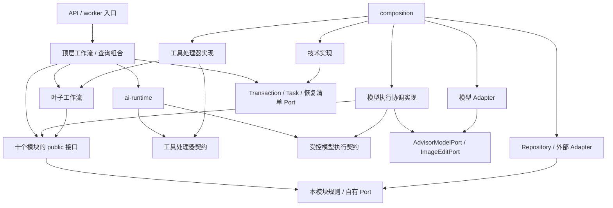
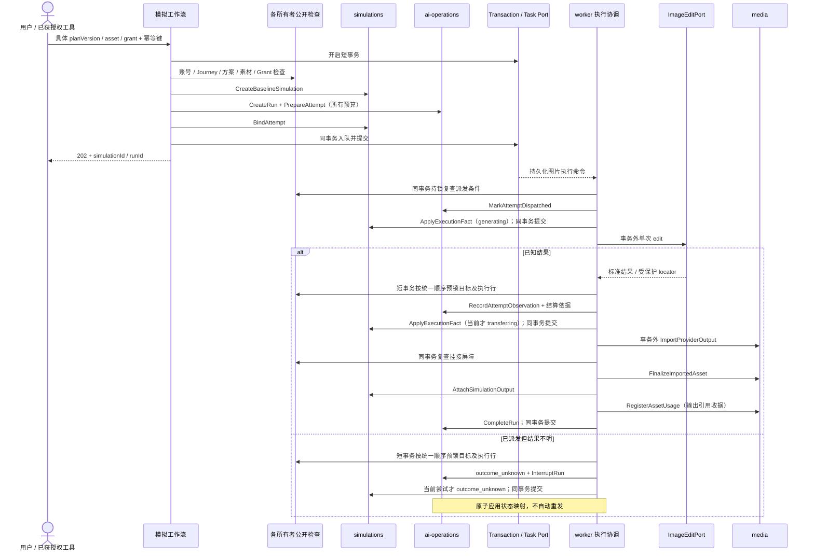

# HairMate MODULES — 模块依赖与接口契约

版本：1.0.0 · 日期：2026-09-13 · 状态：开发契约设计，尚无对应业务代码。

依据：[ARCHITECTURE.md](./ARCHITECTURE.md) v1.0.0，尤其第 2、3、5、6、7、9 节。本文细化“谁依赖谁、通过什么边界交互”，不重新选技术栈、不改变产品范围。产品依据仍为 [产品文档 v1.0.0](./2026-09-12-hairmate-product-v1.0.0-design.md)。若契约需要改变架构或用户授权范围，先报告冲突并取得必要批准，不以本文件覆盖原决定。

沿用且仅沿用十个业务模块：`identity`、`profiles`、`journeys`、`styling`、`simulations`、`briefs`、`haircuts`、`media`、`consultations`、`ai-operations`。`workflows`、`ai-runtime`、`composition`、`infrastructure` 是既有协调 / 技术边界，不是新增业务模块。

- **[MVP]**：本期必须落实的契约；不表示已实现。
- **[Reserved]**：只记录边界及启用条件；没有消费者时不生成接口代码、空表、SDK 或假成功实现。
- **[Future]**：本期不开发。本文不因接口设计而启用生活场景模拟、匹配、地图、产品通知、预约或支付。

## 1. 模块依赖总览

### 1.1 三种关系不能混在一张调用图里

1. **代码依赖**：谁可以导入谁。业务模块不导入其他业务模块的实现、Repository、表或可写实体；本期跨模块调用统一由 `workflows` 通过 `public.ts` 组合。
2. **业务事实依赖**：某个用例需要其他模块拥有的已验证事实。事实以只读 DTO 交给用例，不授权消费者回查或修改生产者的数据库。
3. **运行调用 / 任务投递**：同步调用在同一进程完成；异步工作是工作流向既有持久化任务驱动提交命令，由 worker 调用执行工作流。不是模块互发领域事件。

本文的“上游”指提供所需业务事实的模块，“下游”指消费本模块事实的模块；统一写作 **消费者 → 提供者**。例如 `briefs → styling` 表示 Brief 需要明确的方案版本。实际执行是 `工作流 → styling.Query`，再 `工作流 → briefs.Command`，不是 Brief 自己调用 Styling。

数据关联允许往返：方案属于历程，历程又选择方案；这不等于允许代码双向依赖，也不要求把关联删除。通过“先产生独立事实 → 再引用其版本 / 收集证据”的阶段拆解，避免相互等待对方创建完成。

### 1.2 允许的代码依赖 DAG — [MVP]

箭头表示代码依赖，不表示 SDK 请求沿箭头返回。`composition` 负责装配，还会依赖顶层入口所需契约；图省略这一连线。十个模块之间没有直接代码依赖边。

`ai-runtime` 不导入顶层工作流或工具实现；工具实现只导入叶子工作流。禁止通过一个汇总导出文件使“叶子工作流 → 顶层 RunConsultationTurn → Runtime → 工具”形成包级循环。`public.ts` 不得重导出 Adapter / ORM 类型。

### 1.3 依赖强度与类型

| 标识 | 语义 |
| --- | --- |
| S | 同步 Application 调用；本期真实跨模块调用方都是协调层，不是另一个业务模块 |
| D | 数据 / 事实依赖；通过工作流传递 ID、不可变版本或同事务检查的只读事实 |
| I | 基础设施依赖；消费者依赖抽象 Port，Adapter 依赖该 Port 并封装供应商 |
| A | 持久化异步任务命令；不是 PubSub 或领域事件订阅 |
| 强 | 对指定用例不可缺失；缺失必须拒绝或返回明确缺失状态，不能伪造成功 |
| 条件强 | 仅在该材料、生成能力或路径被使用时必须成立；未使用时可走已有文字 / 手动 / 降级路径 |

“条件强”不等于调用失败后忽略错误。查询投影允许显示缺失，但写操作不得把未核实事实当作成立。数据库是所有持久化命令的强依赖；模型不是查看历史、记录理发或反馈的运行依赖。

## 2. 模块依赖关系表

### 2.1 每模块的上游、下游与循环风险 — [MVP]

本表只列模块自身契约真正消费的跨域事实，不把 ContextBuilder / 页面聚合读到的所有模块误列为 `consultations` / `journeys` 的直接依赖。括号内为下节关系编号；各关系类型为 D，由 S 组合实现。

| 模块 | 上游依赖模块 | 下游被依赖模块 | 自有基础设施依赖 I | 循环风险与处理 |
| --- | --- | --- | --- | --- |
| identity | 无业务上游 | 其余九个模块（D01） | 自有 Repository、AuthPort；邮箱方案下 AuthMailPort | 删除协调不能让 Identity 回调九个模块；协调留在 workflows |
| profiles | identity；media（D03） | journeys、styling、briefs（D04） | 自有 Repository | 素材引用仅 ID；Media 的反向 usage 不是回调 |
| journeys | identity；profiles（D04）、styling（D05）、simulations（D06）、briefs（D07）、haircuts（D08）、media（D09） | styling、simulations、briefs、haircuts、media、consultations、ai-operations（D02） | 自有 Repository | 与历程内资源存在双向数据关系；创建只需 active Journey，选择 / 评估才消费后续证据 |
| styling | identity、journeys；profiles（D04）、media（D10）、ai-operations（D11） | journeys、simulations、briefs、ai-operations（D05） | 自有 Repository | 方案不回写 Journey；生成来源引用不触发新 AiRun |
| simulations | identity、journeys；styling（D05）、media（D12）、ai-operations（D13） | journeys、briefs、ai-operations（D06） | 自有 Repository | 创建绑定与执行事实分阶段；不调用 AI / Media 服务 |
| briefs | identity、journeys；profiles（D04）、styling（D05）、simulations（D06）、media（D14）、ai-operations（D11） | journeys、haircuts（D07） | 自有 Repository；BriefView 之外的 Renderer 在客户端边缘 | 不反向选择方案；不从 Visit 反写交付修订 |
| haircuts | identity、journeys；briefs（D07）、media（D15）、consultations（D16） | journeys（D08） | 自有 Repository | 代录只核实消息来源；不回调顾问运行或生成新偏好 |
| media | identity；journeys（D02，限历程素材）、ai-operations（D17） | profiles、journeys、styling、simulations、briefs、haircuts、ai-operations、consultations（D03、D09、D10、D12、D14、D15、D18、D21） | 自有 Repository、ObjectStoragePort、ProviderResultFetcher | AssetUsage 是反向索引，不让 Media 调用引用模块或协调全账号删除 |
| consultations | identity、journeys；ai-operations（D19）、media（D21） | haircuts（D16）、ai-operations（D20） | 自有 Repository | Message 先持久化，再建立运行关联；模块不启动 Runtime |
| ai-operations | identity、journeys；styling（D05）、simulations（D06）、media（D18）、consultations（D20） | styling、simulations、briefs、media、consultations（D11、D13、D17、D19） | 自有 Repository；模型 Port 由执行协调层消费 | Run / Attempt 是执行事实，不调用目标模块；结果应用由工作流组合 |

ContextBuilder / 查询组合还可只读访问任一当前用例所需模块的公开查询；这增加的是 **协调层 → 模块** 的 S 边，不是 Consultation 拥有其他模块的业务规则。

### 2.2 依赖原因、方向与强度

| 编号 | 方向：消费者 → 事实提供者 | 原因 / 契约 | 类型 | 强度 |
| --- | --- | --- | --- | --- |
| D01 | 其余九模块 → identity | 可信 Actor、账号屏障；出站处理另需具体用途同意，不把普通私人读取与模型授权混同 | D，经 S 检查 | 强；具体 Consent 按操作要求 |
| D02 | styling / simulations / briefs / haircuts / media / consultations / ai-operations → journeys | owner、journeyId、可执行动作、删除屏障；创建子资源不得跨历程 | D，经 S 检查 | 强；media 仅绑定历程时 |
| D03 | profiles → media | 档案照片存在、用途与可用状态；档案只持 assetId | D | 条件强：引用照片时 |
| D04 | journeys / styling / briefs → profiles | 已确认条件及不可变 snapshot；分别用于完成证据、推荐依据、Brief 硬限制 | D | Styling / Brief 依据强；Journey 完整评估强，未完成可报告缺失 |
| D05 | journeys / simulations / briefs / ai-operations → styling | 具体 planVersion 的所属与内容；分别用于选择、编辑、交付、授权范围确认 | D | 对选择 / 生成 / Brief / Grant 强 |
| D06 | journeys / briefs / ai-operations → simulations | 有效比较 / 质量事实、选入交付的对应图片、待执行业务目标与 currentAttempt | D | 完整比较强；Brief 图片条件强；图片派发强，顾问调用无此依赖 |
| D07 | journeys / haircuts → briefs | 具体修订内容、确认事实、现场所引用的版本及快照；取得材料证据由 journeys 自有 Evidence 提供，不以 currentBrief 替代当时版本 | D | 完整闭环强；未带 Brief 的 Visit 可显式降级 |
| D08 | journeys → haircuts | 同一 visitId 的 VisitRevision、剪后与首次自行打理反馈及体验时间 | D | 完整评估强；缺失时 incomplete / degraded |
| D09 | journeys → media | 比较和材料取得引用的素材归属 / 当时可用事实；后续删除标记缺失 | D | 使用图片证据时强 |
| D10 | styling → media | 用户参考图的来源、用途和 assetId；不复制对象位置 | D | 条件强 |
| D11 | styling / briefs → ai-operations | 模型草稿的 run / attempt / Prompt 来源及允许的写入上下文 | D | AI 生成草稿时强；用户显式修改不伪造 AI 来源 |
| D12 | simulations → media | 输入绑定、输出 Asset、校验及删除状态；质量不由 Media 决定 | D | 图片请求 / 挂接强 |
| D13 | simulations → ai-operations | 已有 Grant、Attempt 及派发 / 成功 / 不明 / 费用事实 | D | 生成强；历史失败仍可查询 |
| D14 | briefs → media | 确认可展示材料及其用途 / 生命周期 | D | 有图片材料时强；文字版仍可存在 |
| D15 | haircuts → media | 剪后 / 打理照片的归属、用途和可用状态 | D | 上传附件时强；文字反馈不依赖 OSS |
| D16 | haircuts → consultations | Agent 代录必须绑定真实用户消息、明确表达片段和来源 | D | 代录强；本人表单记录无此依赖 |
| D17 | media → ai-operations | 导入结果所属 attemptId、经验证 Provider 结果、已派发来源和有效期 | D | 生成结果导入强；普通上传无此依赖 |
| D18 | ai-operations → media | 派发时的输入可用 / 用途事实；不存在或被删除不能新调用 | D | 带图出站处理强 |
| D19 | consultations → ai-operations | 消息关联运行、最终响应 / 提议的执行来源 | D | AI 结果写入强；保存首条用户消息无需现存 Run |
| D20 | ai-operations → consultations | 顾问任务对应的已落库用户消息、owner / journey 和输入范围 | D | 顾问轮次强；图片执行不依赖会话存在 |
| D21 | consultations → media | 消息附件的合法素材引用、用途和可用事实；消息不拥有图片对象 | D | 消息带图时强；纯文字轮次不依赖 OSS |

表内双向 D 关系是已存在的事实关联，不批准双向 S 或代码依赖。创建阶段不得要求后续结果已经存在：先 Message 再 Run；先 Simulation 绑定再 Attempt；先方案再选择。必要关联在同一短事务内完成，对外不暴露半成品。

### 2.3 协调层的真实调用关系

| 调用方 → 被调用方 | 类型 / 强度 | 原因与边界 |
| --- | --- | --- |
| API / worker → 顶层工作流 | S / 强 | 入口只做传输校验、身份接入和响应映射；不写领域表 |
| 工作流 → 本次涉及模块的公开接口 | S / 强 | 组合事实和原子命令，不取得 Repository |
| Runtime → 注入的工具处理器 → 叶子工作流 | S / 按工具强 | Runtime 校验调度；叶子用例裁决业务动作；不再次启动顶层 Runtime |
| Runtime → 受控模型执行契约 | S / AI 调用强 | 每次调用先经 ai-operations 预留 / 派发，再通过模型 Port；不是 SDK 直通 |
| 工作流 → TransactionPort / TaskPort | I；提交任务时 A / 强 | 同事务提交业务记录与任务；队列状态不替代业务状态 |
| 各模块 → 自有 Repository Port | I / 强 | 仅访问自有数据；实现可使用既定 PostgreSQL / Drizzle |
| Media → 存储 / 下载 Port；Identity → AuthPort | I / 对应操作强 | 私有文件与身份协议各有唯一业务入口 |
| 执行协调层 → AdvisorModelPort / ImageEditPort | I / 生成时强 | 唯一真实模型派发出口；历史读取 / 手动反馈不依赖模型在线 |

## 3. 接口边界与公共契约

### 3.1 四类接口

| 类别 | 谁定义 / 谁使用 | 可以暴露什么 | 禁止暴露什么 |
| --- | --- | --- | --- |
| Application / Service | 模块 `public.ts`；工作流消费 | 具名命令、查询、只读 DTO、领域错误 | 任意 update、可写实体、跨域表操作、模块私有规则 |
| Repository / Data | 各模块自有 Port；该模块用例消费 | owner 范围的聚合读取、版本追加、条件写入、必要锁语义 | 向其他模块暴露 Repository、ORM 对象、通用 SQL、跨域 Join 写入 |
| External Provider | 能力消费者定义 Port；边缘 Adapter 实现 | 单一能力的输入、输出、能力声明、标准化失败 | SDK 类型、Secret、任意 baseURL、供应商品牌判断进入业务规则 |
| Event / Message | 工作流定义具名任务契约；TaskPort 投递、worker 消费 | 必要 ID、消息版本、执行关联与截止信息 | 领域事件总线、任意 topic、任意模块订阅、照片 / token / Prompt 全文 |

本文件的接口名称是用例契约标识，不要求一接口一类、一方法一文件。下表输入是语义上必须具备的信息，不是 TypeScript 函数签名或完整 HTTP Schema。

### 3.2 通用输入、输出与信任边界 — [MVP]

| 契约 | 含义与约束 |
| --- | --- |
| ActorContext | 服务端根据会话产生 userId、调用来源、requestId；worker 重新取得账号 / 授权事实。Tool 参数不能提供或覆盖身份 |
| CallOrigin | `user_api / agent_tool / worker / maintenance`；服务端确定。确认命令仅接受真实用户操作入口，维护入口不冒充用户确认 |
| WorkerExecutionContext | worker 的内部执行身份 + 已持久化目标范围；不携带已过期用户会话，不等于用户确认。恢复扫描只获准读最少待处理 ID；每个目标执行重新建立 owner 范围并检查屏障 / 用途 |
| UserActionRef | 与已认证请求、具体命令、目标版本及规范化内容绑定的用户动作记录；不是客户端可传的 `confirmed: true`，也不是通用签名令牌平台 |
| CommandContext | ActorContext、operation、幂等标识、必要的 expectedRevision；Run 内工具 / 执行另带服务端 runId、executionVersion；跨模块原子操作使用工作流传入的不透明 TransactionContext |
| ScopedFacts | 协调层从模块公开查询 / 检查获得的只读事实，带 owner / journey、来源、对象版本；不能接受客户端 / 模型自行构造的“已授权事实” |
| SnapshotRef | 不可变实体 ID + 内容 schemaVersion；引用具体版本，不能用 current 指针替换历史 |
| CommandReceipt | 本模块资源 ID、版本、本事务已应用的动作和安全状态；只有外层事务 commit 成功后才是已提交事实，不携带 SQL 行、永久 URL 或原始 Provider 响应 |
| QueryResult | owner 范围的只读 DTO，明确 missing / unavailable / unknown；批量输入有上限，列表有 cursor / limit |
| DomainError | 沿用 ARCHITECTURE §7.4 的 code、message、retryable、安全 details、requestId；模块间不传 HTTP Response 或 SDK Exception |

信任边界不是“工作流传入了布尔值就安全”：工作流负责从可信入口取得事实，所属模块仍检查自己的所有权、状态、版本和规则。对并发敏感事实，必须在同一事务内通过拥有者的检查接口取得并持有相应锁 / 条件保护；不得把一次普通查询所得 `ScopedFacts` 长期缓存为派发许可。

用户本人表达、用户代录的现场话语、模型推测分别标来源。语义难以确定时保存提议 / 待确认，不伪造评分、现场事件、硬条件或长期偏好。

### 3.3 调用、幂等与错误缩写

- **S**：同进程同步契约，调用方等待 DB / 检查结果；不表示同步 CPU 函数。模块命令返回本事务应用收据，不自行提交外层事务或投递队列；只有最外层 commit 成功后才向入口返回已提交成功。
- **Q**：只读，可重复调用；授权读取可能每次产生不同短时链接，不要求字节相同。
- **K**：写入使用 `(actorId, operation, idempotencyKey)` + 规范化输入摘要；同键同内容返回同一业务结果，不同内容 `IDEMPOTENCY_CONFLICT`。派生子命令键包含工作流操作与子步骤，不独立创建第二个业务动作。
- **V**：除 K 外还检查 `expectedRevision`；冲突 `VERSION_CONFLICT`，不自动覆盖。
- **N**：按自然唯一键幂等，例如 `(attemptId, outputIndex)`、`(runId, toolCallId)`；同键不同内容必须拒绝或走具名修订流程。

幂等只在重新通过访问 / 删除检查后返回安全结果；不能由旧幂等响应复活已删数据或泄漏被撤权素材。K / N 的写入、结果引用与必要领域变更同事务提交。

所有个人资源接口都可能返回 `AUTH_REQUIRED / RESOURCE_NOT_FOUND / ACTION_NOT_ALLOWED / VALIDATION_FAILED / INTERNAL_ERROR`。所有写入还可能返回 `IDEMPOTENCY_CONFLICT / VERSION_CONFLICT / INVALID_STATE`。各表“错误”列只列额外或最关键语义，省略不代表可以跳过通用校验。资源越权对外优先隐藏存在性；删除 / 撤销阻止新动作，用 `INVALID_STATE / CONSENT_REQUIRED` 表达，不自动重试。

## 4. 各模块关键 Application 接口

除明确标为只读的 Q 外，下列 S 命令接受第 3 节的 CommandContext。跨模块原子性由第 5 节工作流保证。这里只列跨边界使用的重要能力；认证库自有协议、模块内部私有函数不展开。

### 4.1 identity

数据归属：User、认证映射、ConsentRecord、账号删除屏障及协调检查点。其余模块只引用 userId / consentId，不修改这些记录。

| 接口名称 / 职责 | 调用方 | 输入 | 输出 | 错误 / 异常语义 | 同步 / 幂等 | 权限或前置条件 |
| --- | --- | --- | --- | --- | --- | --- |
| ResolveActor：映射可信会话 | API 认证桥接 | AuthPort 验证结果、请求来源 | ActorContext、账号状态 | AUTH_REQUIRED；无效映射不创建匿名业务身份 | S / N：认证身份映射唯一 | 只接受服务端认证结果，不接受请求中的 userId |
| CheckAccountAccess：核实账号与屏障 | 所有个人用例；派发 / 挂接工作流 | userId、具名动作、必要 tx | 账号事实 / 明确拒绝 | 停用或删除 INVALID_STATE | S / Q；事务检查可持锁 | worker 也重新检查；此阶段仅处理 User，不提前取得后序 Consent 锁 |
| CheckConsentUse：核实具体用途同意 | 出站处理 / 派发 / 挂接工作流 | consentId、purpose / scope、当前动作、必要 tx | 同意事实、版本 / 撤销信息 | CONSENT_REQUIRED / INVALID_STATE | S / Q；需要时持锁 | 先取得 User / 必要 Journey 屏障；读历史不默认要求新的模型处理同意 |
| ConfirmConsent：记录具体用途同意 | 用户授权工作流 | purpose、scope、说明版本、UserActionRef | ConsentRecord ID / revision | CONSENT_REQUIRED、CONSTRAINT_CONFLICT | S / K | 真实用户入口；不合并咨询、分享、跨用户用途 |
| RevokeConsent：撤销具体同意 | 用户撤销工作流 | consentId、UserActionRef、expectedRevision | 撤销事实、生效屏障时间 | INVALID_STATE；已撤销重放返回原事实 | S / V | 本人；与派发 / 挂接使用同一锁协议；不承诺撤回已发送请求 |
| BeginAccountDeletion：设置账号屏障 | 账号删除工作流 | UserActionRef、目标 userId | deletionId、pending 状态 | INVALID_STATE；失败不标完成 | S / K | 本人；同事务提交清理任务，后续外部清单在事务外 |
| AdvanceAccountDeletion：持久化协调检查点 | 账号删除 worker | deletionId、expectedRevision、已核实各步骤收据 | 账号删除进度 / 完成状态 | INVALID_STATE：清单、内容清理或晚到窗口未满足 | S / V | 受限 worker；不在本模块调用其他模块；完成需全部收据 |

### 4.2 profiles

数据归属：HairProfile、不可变 HairProfileSnapshot、字段来源及确认。模型建议不能调用用户确认写入通道。

| 接口名称 / 职责 | 调用方 | 输入 | 输出 | 错误 / 异常语义 | 同步 / 幂等 | 权限或前置条件 |
| --- | --- | --- | --- | --- | --- | --- |
| ReadProfileFacts：读取当前档案或指定快照 | 推荐 / Brief / 评估 / ContextBuilder | owner 范围、profileId 或 snapshotId | 字段、source / confirmedAt、版本；未知仍 unknown | RESOURCE_NOT_FOUND；旧 schema 无解码器不得按最新猜读 | S / Q | 本人范围；只返回本用例需要的字段 |
| ApplyConfirmedProfileChange：保存明确条件 / 长期偏好 | 用户档案工作流 | 字段改动、UserActionRef、expectedRevision、可选已核实 AssetFacts | 新 Profile revision、字段来源 | CONSTRAINT_CONFLICT；模型推断不得标 confirmed | S / V | 仅真实用户确认；长期建议需独立明确接受 |
| CaptureProfileSnapshot：固化本轮依据 | 推荐 / 新方案依据准备工作流 | profileId、expectedRevision、快照原因 | snapshotId、schemaVersion、不可变事实 | VERSION_CONFLICT；资料不足可保留未知，不补造条件 | S / K | 账号可用；引用素材已核实，不在此签名或复制图片；普通 Brief 读取方案原有快照，不捕获当前快照替代 |

### 4.3 journeys

数据归属：HairJourney、PlanSelection、JourneyEvidence、GoldenPathAssessment、PilotEnrollment、历程删除协调检查点。评估和 UI 阶段不是其他模块可写的共享状态。

| 接口名称 / 职责 | 调用方 | 输入 | 输出 | 错误 / 异常语义 | 同步 / 幂等 | 权限或前置条件 |
| --- | --- | --- | --- | --- | --- | --- |
| CreateJourney：建立本次目标 | 用户创建工作流 | 目标、确认的 owner 范围 | journeyId、active、revision | CONSTRAINT_CONFLICT | S / K | 账号可写；不以已有方案 / Run 为前置 |
| ReadJourneyFacts：读取目标、选择和证据引用 | 工作流 / ContextBuilder / 查询组合 | journeyId、所需事实范围 | JourneyFacts、revision、当前选择及历史引用 | RESOURCE_NOT_FOUND | S / Q | 同 owner；返回引用不自动扩大其他模块读取权限 |
| CheckJourneyAccess：核实历程动作与屏障 | 历程内写入、派发、挂接工作流 | journeyId、具名动作、必要 tx | 同事务有效的 JourneyFacts | INVALID_STATE / ACTION_NOT_ALLOWED | S / Q；需要时持锁 | closed 的历史读取与继续修改区分；不得接受通用 setStatus |
| SelectPlan：保存用户选择 | 用户选择工作流 | PlanVersionFacts、UserActionRef、expectedRevision | 新 PlanSelection、Journey revision | VERSION_CONFLICT / CONSTRAINT_CONFLICT | S / V | 明确版本属于本历程；选择不等于生成授权 |
| RecordComparison：记录实际原图比较 | 用户比较工作流 | 原照、SimulationOutput / quality 事实、planVersionId、用户动作时间 | 比较 Evidence ID | CONSTRAINT_CONFLICT：非 accepted、版本或素材不对应 | S / K | 本历程、实际用户比较动作；不能由返回图片推断已比较 |
| RecordBriefDelivery：记录已取得材料 | 用户交付回执工作流 | 已确认 BriefRevisionFacts、查看 / 保存 / 导出成功回执、实际时间 | 取得材料 Evidence ID | INVALID_STATE / CONSTRAINT_CONFLICT | S / K | 本人设备真实动作；仅获取 API 200 不满足取得证据 |
| AssessJourney：计算并保存闭环结论 | 评估工作流 | 版本化证据包、可缺失的 visitId、policyVersion、读取修订指纹 | complete / degraded / incomplete、缺失项、assessmentId | 无 Visit 返回 incomplete；读取后冲突 VERSION_CONFLICT；缺证据不是假成功 | S / N：证据指纹 + policyVersion | 不造占位 Visit；存在 Visit 时每次闭环只使用该 visitId；满意度单列 |
| CloseJourney：关闭本次历程 | 用户关闭工作流 | UserActionRef、expectedRevision、关闭原因 | closed / abandoned 及 revision | INVALID_STATE / VERSION_CONFLICT | S / V | 关闭与完整成功独立，不自动补证据 |
| RecordPilotEnrollment / ReadPilotAssessment：维护固定试点口径 | 经批准试点维护 / 查询工作流 | 已同意参与者、固定观察窗、版本化评估引用；或 cohort 查询 | Enrollment / 汇总与缺失分类 | CONSTRAINT_CONFLICT：改变分母或无来源结论 | S / K；查询 Q | 不建立后台或跨用户明细开放 API；仅受控维护，删除隐私优先 |
| BeginJourneyDeletion / AdvanceJourneyDeletion：屏障与协调进度 | 用户历程删除 / 清理 worker | 用户动作或 deletionId + 具名步骤收据、expectedRevision | deletionId / 进度 | INVALID_STATE：缺清单或清理证据不得完成 | S / K；推进 V | 所属用户；协调层调用各所有者，Journey 不遍历他域 Repository |

### 4.4 styling

数据归属：Hairstyle、Recommendation、候选关联、StylePlan、不可变 StylePlanVersion。来源资料与私人个性方案不合并。

| 接口名称 / 职责 | 调用方 | 输入 | 输出 | 错误 / 异常语义 | 同步 / 幂等 | 权限或前置条件 |
| --- | --- | --- | --- | --- | --- | --- |
| SearchHairstyles：查询有来源资料 | 顾问检索叶子工作流 | 结构化条件、来源过滤、cursor / limit | 资料 DTO、sourceRef、适用 / 未知条件 | VALIDATION_FAILED；无匹配返回空集 | S / Q | 仅现有合法资料；不解释为任意网页搜索 |
| SaveRecommendationDraft：校验和落库推荐 | 顾问工具叶子工作流 | ProfileSnapshotFacts、JourneyFacts、候选草稿、来源、AiRunFacts、可选素材事实 | Recommendation ID、候选 versionId、约束 / 未知结果 | CONSTRAINT_CONFLICT：不合法草稿不作为可执行方案 | S / K；工具派生键 | 允许该工具的当前 Run；LLM 内容须校验；不顺便 SelectPlan |
| AppendPlanVersion：追加修改版本 | 用户修改 / 已授权草稿工作流 | baseVersionId、结构化改动、依据与来源、expectedRevision | 新 versionId、不可变内容 | VERSION_CONFLICT / CONSTRAINT_CONFLICT | S / V | 同 owner / journey；已确认硬限制不能被模型改写 |
| ReadStylingFacts：取得候选或明确版本 | 推荐查询、授权、模拟、选择、Brief、ContextBuilder | journeyId + candidate refs，或精确 versionIds；有界批量 | Recommendation / PlanVersionFacts、schemaVersion、来源 | RESOURCE_NOT_FOUND；未知版本不回退 current | S / Q | 私人方案同 owner；不返回其他用户方案 |

### 4.5 simulations

数据归属：Simulation、Input、Output、QualityReview、currentRun / currentAttempt 及选中输出。执行成本和授权归 ai-operations；对象位置归 Media。

| 接口名称 / 职责 | 调用方 | 输入 | 输出 | 错误 / 异常语义 | 同步 / 幂等 | 权限或前置条件 |
| --- | --- | --- | --- | --- | --- | --- |
| CreateBaselineSimulation：固定业务输入 | 模拟申请叶子工作流 | Journey / PlanVersion / Asset / GrantFacts，mode=baseline | simulationId、输入绑定、queued、revision | UNSUPPORTED_CAPABILITY / CONSTRAINT_CONFLICT | S / K | 素材、方案和 Grant 范围一致；同事务配套 Attempt / 预算 / job |
| ReadSimulationFacts：读取具体模拟 / 输出 | 状态查询、比较、Brief、ContextBuilder、执行工作流 | simulationId 或有界输出 refs | execution、quality、输入版本、current refs、输出事实 | RESOURCE_NOT_FOUND | S / Q | 同 owner / journey；不返回 Provider locator |
| CheckSimulationExecution：检查当前执行条件 | 派发 / 挂接 / 新尝试工作流 | simulationId、runId / attemptId、expectedRevision、动作、tx | 绑定与 current 指针事实 / 明确旧尝试标记 | INVALID_STATE / VERSION_CONFLICT | S / Q；需要时持锁 | 不独自核实 Grant / 素材；由工作流在同事务组合其所有者检查 |
| BindAttempt：绑定初次或显式新尝试 | 模拟申请 / 再尝试工作流 | 已准备 Run / AttemptFacts、expectedRevision、必要用户风险接受记录 | 更新的 currentRun / currentAttempt、revision | INVALID_STATE：已有活动尝试；VERSION_CONFLICT | S / V | 旧结果不明时需明确风险接受且有额度；输入与 planVersion 不静默换绑 |
| ApplyExecutionFact：应用受控执行阶段 | 图片执行 / 恢复工作流 | 明确 attemptId、已落库 Attempt 事实或 Media 导入收据及版本、具名阶段 | generating / outcome_unknown / transferring / failed / cancelled | INVALID_STATE / VERSION_CONFLICT；旧 attempt 不改 current 状态 | S / N：attempt + 执行事实版本 | 仅 worker；只接受允许的状态映射，不开放任意目标 status |
| AttachSimulationOutput：挂接转存结果 | 图片最终挂接工作流 | attemptId、已验证 AssetFacts、outputIndex、授权 / 屏障事实 | 输出 ID、pending_review；当前尝试可 ready | INVALID_STATE：删除 / 撤销则不挂接；旧尝试返回独立历史输出语义 | S / N：attempt + outputIndex | 同事务检查全部屏障；只创建当次输出关联，不调用选择命令或覆盖用户已有选择 |
| ReviewSimulationOutput：独立质量检查 | 用户质量工作流 / 受控维护检查 | outputId、显式检查项、accepted / rejected、来源、expectedRevision | QualityReview、版本 | CONSTRAINT_CONFLICT / VERSION_CONFLICT | S / V | 用户或明确维护路径；Agent 自评不能设 accepted；失败图仍计费 |
| SelectSimulationOutput：保存采用的模拟输出 | 现有用户材料选择工作流 | simulationId、outputId、UserActionRef、expectedRevision、AssetFacts | 选中 outputRef、revision | CONSTRAINT_CONFLICT / VERSION_CONFLICT | S / V | 只选本模拟的有效输出；选图不改最终方案、不增加生成授权；旧结果不自动替换该选择 |

### 4.6 briefs

数据归属：HaircutBrief、BriefRevision、确认及材料关联。材料已取得证据归 Journeys；设备导出归客户端边缘。

| 接口名称 / 职责 | 调用方 | 输入 | 输出 | 错误 / 异常语义 | 同步 / 幂等 | 权限或前置条件 |
| --- | --- | --- | --- | --- | --- | --- |
| SaveBriefDraft：校验并追加交付草稿 | Brief 起草 / 顾问工具叶子工作流 | 明确 PlanVersion 及其 profileSnapshotId 对应事实、草稿、材料事实、来源 / runRef、baseRevision | draft Revision ID、核实 / 冲突提示 | CONSTRAINT_CONFLICT：快照不匹配或硬限制冲突；VERSION_CONFLICT | S / K；修改需 V | 不用最新档案静默替换方案依据；不制造实测精度 / 化学配方；不改旧确认修订 |
| ConfirmBriefRevision：确认具体交付 | 用户确认工作流 | revisionId、当前 PlanSelectionFacts、UserActionRef、expectedRevision | confirmed Revision、确认事实 | CONSTRAINT_CONFLICT：非当前选择版本；VERSION_CONFLICT | S / V | 仅本人确认入口；不得以工具参数代替 |
| ReadBriefFacts：提供版本 / 确认事实 | 历程证据 / Visit / 评估 / ContextBuilder | briefId + revisionId | 结构化事实、材料 IDs、确认、schemaVersion | RESOURCE_NOT_FOUND | S / Q | 精确版本；旧确认与当前选择不一致应标注，不改历史 |
| ReadBriefView：生成可展示 / 导出的内容表示 | App Brief 查询组合 | revisionId、当前固定模板版本、已核实可用材料摘要 | BriefView、版本 / 示意标记、缺失材料提示 | INVALID_STATE：不可用修订不能冒充可交付版 | S / Q | 不包含永久 key / Provider URL；素材访问仍逐项通过 Media；不引入多语言功能 |

当前档案出现影响方案或硬限制的新条件时，先追加有明确新依据的方案版本，再由用户重新选择并起草新的 Brief；不能将旧 PlanVersion 与新 ProfileSnapshot 拼成“原方案”。

### 4.7 haircuts

数据归属：HaircutVisit、VisitRevision、Feedback 及修订、私人 Stylist / Salon。MVP 个人 / 门店信息通过 Visit 的具名输入维护，不另建目录或匹配 API。

| 接口名称 / 职责 | 调用方 | 输入 | 输出 | 错误 / 异常语义 | 同步 / 幂等 | 权限或前置条件 |
| --- | --- | --- | --- | --- | --- | --- |
| RecordVisit：记录一次实际理发 | 用户理发记录工作流 | journeyId、发生日期 / 时区、shownBriefRevision 或明确未使用、现场约定 / 执行、私人执行者快照、来源 | visitId、首个 VisitRevision、原目标 / 现场 / 实际分栏 | CONSTRAINT_CONFLICT：版本 / 时间 / owner 不一致 | S / K | 用户自报；不要求已知 Stylist，不伪称专业核验 |
| ReviseVisit：纠正而不覆盖历史 | 用户理发修订工作流 | visitId、expectedRevision、改动与纠正来源、相关事实 | 新 VisitRevision、currentRevision | VERSION_CONFLICT / CONSTRAINT_CONFLICT | S / V | PATCH 语义为追加修订；不回写原 Brief |
| RecordFeedback：记录或修订两类体验 | 用户反馈 / explicit-feedback 工具叶子工作流 | visitId、kind、体验时间、明确反馈 / 可选评分、source、replacedFeedbackId、可选 AssetFacts / MessageEvidence | Feedback revision、来源及体验时间 | CONSTRAINT_CONFLICT：体验早于理发、无原话来源或伪造评分 | S / K；修订须 V | after_cut / after_self_styling 分开；代录需真实用户消息，不据模型猜测创建 Visit |
| ReadHaircutEvidence：按一次理发读取复盘事实 | 评估工作流 / ContextBuilder / 私人记录查询 | owner / journey、visitId、指定修订范围 | VisitRevision、所出示 BriefRef、两类 Feedback revisions、私人执行者快照 | RESOURCE_NOT_FOUND；缺反馈明确 missing | S / Q | 不跨 Visit 拼接；不输出个人能力评分 / 跨用户排名 |

### 4.8 media

数据归属：MediaAsset、AssetUsage、对象位置及素材清理任务。任何其他业务模块都不能直接签名、下载 Provider URL、写 / 删用户对象。

| 接口名称 / 职责 | 调用方 | 输入 | 输出 | 错误 / 异常语义 | 同步 / 幂等 | 权限或前置条件 |
| --- | --- | --- | --- | --- | --- | --- |
| PrepareUpload：创建受限上传意图并授权 | 上传工作流 | purpose、声明类型 / 大小、可选 journeyId、账号 / 历程事实 | assetId、短时上传授权、约束和到期时间 | VALIDATION_FAILED / DEPENDENCY_FAILURE | S / K：asset 不重复；过期凭据可重新签发 | 本人用途；先记录意图，外部签名不占 DB 事务；未完成不 available |
| CompleteUpload：核实实际素材 | 上传完成工作流 | assetId、客户端完成通知 | 校验后 available / rejected 的 AssetFacts | VALIDATION_FAILED / DEPENDENCY_FAILURE；声明不代替真实检查 | S / N：assetId + 校验内容 | 检查对象真实类型、尺寸、校验和、方向 / EXIF；不信任客户端 object key |
| ReadMediaFacts / CheckMediaUse：查询或原子检查可用性 | 引用材料 / 派发 / 挂接 / 清理工作流 | 有界 assetIds、用途、owner / journey、必要 tx / 动作 | AssetFacts / Usage refs；不含存储位置 | RESOURCE_NOT_FOUND / INVALID_STATE / CONSENT_REQUIRED | S / Q；检查可持锁 | 共享档案素材须同 owner 且用途允许；不能跨用户引用 |
| AuthorizeMediaAccess：为指定用途签发短时访问 | App 读取 / 导出、模型执行工作流 | assetId、view / export / approved_model_input、受控处理范围 | TemporaryAccess、到期时间 | INVALID_STATE / CONSENT_REQUIRED / DEPENDENCY_FAILURE | S / Q | 新签名需新检查；模型输入仅派发前签发；不接受调用者任意 TTL / key |
| RegisterAssetUsage：登记业务引用 | 保存档案 / 方案 / 模拟 / Brief / 反馈 / 消息工作流 | assetId、所属模块、具体实体版本和用途、目标所有者返回的最小引用收据 | usageRef | CONSTRAINT_CONFLICT / INVALID_STATE | S / N：asset + 引用版本 + 用途 | 目标先创建，再于同事务登记；Media 不反查引用方 Repository；反向索引不引入同步依赖 |
| ImportProviderOutput：受控转存同一结果 | 图片转存工作流 | attemptId、经验证 ProviderResultRef、outputIndex、expiresAt、当前屏障事实 | 已校验待挂接 assetId / 导入收据 | DEPENDENCY_FAILURE；RESULT_EXPIRED 为执行错误原因；禁止再生成 | S，外部耗时 / N：attempt + outputIndex | 只受限 worker；下载 / 写对象在事务外，固定位置，可恢复；不得接受用户任意 URL |
| FinalizeImportedAsset：使结果可引用 | 图片最终挂接工作流 | 导入收据、attemptId、同事务屏障事实 | available AssetFacts | INVALID_STATE：删除 / 撤销进入清理，不能 available | S / N | 与 AttachSimulationOutput、Run 完成同事务；未挂接对象不对 App 开放 |
| BeginAssetDeletion / AdvanceAssetCleanup：素材屏障与物理清理 | 用户素材删除 / 清理 worker | 用户动作或 deletionId、对象清理收据、expectedRevision | 素材删除进度 / 引用不可用事实 | DEPENDENCY_FAILURE：保持 pending；不谎报 deleted | S / K；推进 N / V | 仅删除已解析目标；与派发检查共享屏障，对象删除事务外幂等 |

`ImportProviderOutput` 在数据库可用前崩溃时，也必须能按既定 attempt / outputIndex 找回已写对象。暂存结果的受保护定位信息不属于公开 Media DTO；各模块只通过 assetId 和导入收据交互。

### 4.9 consultations

数据归属：Consultation、Message、DraftProposal、摘要与其原始消息范围。上下文聚合及 LLM 执行不在此模块；运行 / 工具幂等记录归 ai-operations。

| 接口名称 / 职责 | 调用方 | 输入 | 输出 | 错误 / 异常语义 | 同步 / 幂等 | 权限或前置条件 |
| --- | --- | --- | --- | --- | --- | --- |
| AppendUserTurn：保存用户原始表达 | 开始轮次工作流 | journeyId、用户消息、经核实附件 AssetFacts、UserActionRef | consultationId、messageId、turnRef | CONSTRAINT_CONFLICT | S / K | 本人已认证消息；不得让模型设置 user role；附件 usage 与消息同事务登记 |
| LinkTurnRun：关联已创建运行 | 开始轮次工作流 | messageId、AiRunFacts | turn / run 关联 | CONSTRAINT_CONFLICT：owner、journey 或源消息不匹配 | S / N：turn + run | 与 AppendUserTurn、CreateRun、job 同事务；此接口不启动 Runtime |
| ReadConversationEvidence：读取必要消息 / 来源 | ContextBuilder、代录验证、运行查询组合 | consultation / message refs、限定范围和数量 | 用户原话、role / source、已有 proposal、runRefs | RESOURCE_NOT_FOUND | S / Q | 同 owner / journey；摘要仅辅助，不代替原话证明 |
| SaveAssistantOutcome：保存响应或提议 | 顾问完成 / 需确认工作流，复盘提议工具 | runId、验证后的可见响应 / DraftProposal、业务结果 refs、来源版本、明确 outcomeKind | message / proposal refs、确认待办 | CONSTRAINT_CONFLICT / INVALID_STATE | S / N：run + outcomeKey；修改需明确新结果 | 工具提议与 ToolCheckpoint 同事务，不结束 Run；最终回复才与 CompleteRun 同事务；均不执行用户确认 |
| SaveContextSummary：保存辅助摘要 | 顾问上下文准备工作流 | 已限定原始消息范围、摘要、来源与 recipeVersion | summaryRef、覆盖范围 | CONSTRAINT_CONFLICT：范围越权或虚构来源 | S / N：来源范围 + 版本 | 如使用模型摘要仍经过预算 / Attempt；不建立独立长期记忆库 |

### 4.10 ai-operations

数据归属：AiRun、ModelAttempt、GenerationGrant、固定作用域 UsageBudget、Reservation、UsageRecord、工具执行检查点及有限审计。下列命令不直接调用模型或写 Simulation / Message。

| 接口名称 / 职责 | 调用方 | 输入 | 输出 | 错误 / 异常语义 | 同步 / 幂等 | 权限或前置条件 |
| --- | --- | --- | --- | --- | --- | --- |
| ConfirmGenerationGrant：记录明确生成范围 | 用户授权工作流 | 精确 planVersionIds / assetIds、baseline、张数 / 成本 / 期限、用途同意事实、UserActionRef | grantId、范围、revision | CONSENT_REQUIRED / BUDGET_EXCEEDED / CONSTRAINT_CONFLICT | S / K | 仅用户入口；不授权其他地区、Provider 用途或新增素材；上限不得超过服务配置 |
| RevokeGenerationGrant：撤销未执行范围 | 用户撤销工作流 | grantId、UserActionRef、expectedRevision | 撤销事实 | INVALID_STATE / VERSION_CONFLICT | S / V | 同锁协议；已经发送不保证可撤回 / 免费 |
| CheckGenerationGrant：读取并检查图片授权范围 | 模拟申请 / 派发 / 挂接工作流 | grantId、明确版本 / 素材 / mode、动作、必要 tx | GrantFacts、版本 / 撤销事实 | CONSENT_REQUIRED / CONSTRAINT_CONFLICT / INVALID_STATE | S / Q；需要时持锁 | 可在还无 Run / Attempt 时核实申请；先 User / Journey / Consent 再 Grant，不提前锁预算 |
| CreateRun：登记顾问或图片工作 | 开始轮次 / 模拟申请工作流 | 类型、目标 / 输入版本 refs、Prompt / Policy 版本、截止与运行上限 | queued AiRun | CONSTRAINT_CONFLICT / CONSENT_REQUIRED | S / K | 顾问有真实 messageRef / 同意；图片有有效目标 / Grant；与业务目标及 job 原子提交 |
| BeginRunExecution：取得运行执行权 | 顾问 / 图片 worker 工作流 | runId、expectedRevision、WorkerExecutionContext、当前权限事实 | 可执行阶段、运行上限、执行权版本 | INVALID_STATE / VERSION_CONFLICT | S / V | 不允许同一轮次多 Runtime；恢复检查不授权重发已 dispatched Attempt |
| PrepareAttempt：为一次调用原子预留额度 | 模拟申请 / 受控顾问执行协调 | runId、调用能力、输入引用、计价版本 / 最大成本、图片 Grant、单张输出限制 | prepared Attempt、所有 Reservation refs | BUDGET_EXCEEDED / UNSUPPORTED_CAPABILITY；计价上限未知不得派发 | S / N：run + callOrdinal | 同事务锁全部适用预算 / Grant；任一不足全部回滚，不创建隐式免费调用 |
| CheckExecutionAuthority：检查运行 / Attempt | 派发 / 工具 / 挂接 / 恢复协调 | run / attemptId、executionVersion、动作、必要 tx、当前账号 / Consent / Grant / 目标事实 | 执行事实、授权快照 / 明确拒绝 | CONSENT_REQUIRED / INVALID_STATE / VERSION_CONFLICT | S / Q；需要时持锁 | 在前序屏障后检查当前执行权，不逆序回锁；派发看有效期，挂接区分自然到期 / 撤销 |
| MarkAttemptDispatched：单次抢占派发权 | 受控模型执行协调 | prepared attemptId、同事务全部屏障事实、输入 / recipe 指纹 | 唯一 dispatch 收据、授权快照、dispatched | INVALID_STATE：已派发不得再次发送；CAS 失败不调模型 | S / N：attemptId | 仅内部执行入口；预算已预留且授权通过；事务提交后才出站 |
| CancelPreparedAttempt：取消尚未派发的调用 | 授权失效 / 删除 / 截止恢复工作流 | attemptId、具名取消原因、同事务屏障及执行事实 | cancelled_before_dispatch、全部预留释放收据 | CAS 发现已 dispatched 则 INVALID_STATE，不释放潜在成本；转入已发送核对路径 | S / N：attemptId | 本命令只取消 Attempt / 释放全部 Reservation；工作流同事务另调 Run 结束与 Simulation 映射命令，不跨域写入 |
| RecordAttemptObservation：记录供应商已知 / 不明结果 | 执行 / 恢复协调 | attemptId、经 Adapter 归一化的结果或发送不明证据、requestRef / 用量依据 | Attempt 新事实版本、受保护 resultRef / 失败原因 | INVALID_STATE / CONSTRAINT_CONFLICT：不允许凭通用超时证明未计费 | S / N：attempt + observationRef | 仅可信执行证据；旧 Attempt 可晚到更正，不在此改 Simulation 当前指针 |
| SettleAttemptUsage：核对调用用量 | 结果 / 期限核对工作流 | attemptId、实际 / 估算 / 不明依据、核对版本 | settled / conservatively_settled / released、差额收据 | CONSTRAINT_CONFLICT；无明确依据不能释放潜在成本 | S / N：attempt + settlementEvidence | 锁所有适用预算；晚到只计差额，同一调用不重复计费 |
| CompleteRun / InterruptRun：应用受控结束事实 | 顾问完成、图片挂接、恢复工作流 | 持久化 outcome refs 或具名中断原因、expectedRevision | succeeded / awaiting_user / failed / interrupted / cancelled | INVALID_STATE：图片未挂接不得 succeeded | S / V | 状态由类型化事实推导，不提供任意 setStatus；awaiting_user 不占 worker |
| ReadRunFacts：读取安全运行事实 | 查询组合、ContextBuilder、草稿来源校验、恢复 | run / attempt refs、owner 范围 | Run / AttemptFacts、预算依据、业务结果引用 | RESOURCE_NOT_FOUND | S / Q | 无 Prompt 全文、临时 URL、Secret 或账单原始响应 |
| ReadAttemptResultForTransfer：读取受保护结果定位 | 仅图片转存 / 清理工作流 | attemptId、WorkerExecutionContext、具名处理用途 | 绑定 Attempt 的 ProviderResultRef、expiresAt、观察版本 | RESOURCE_NOT_FOUND / INVALID_STATE；过期不授权再生成 | S / Q | 不导出到客户端 contracts / 工具结果；不以查询参数开启“包含 URL”模式 |
| ReadToolCheckpoint / RecordToolCheckpoint：工具去重与结果关联 | Runtime 注入的叶子执行协调 | runId、toolCallId、toolName / version、规范化输入摘要、结果 refs | 未执行 / 既有提交结果 / 新检查点 | IDEMPOTENCY_CONFLICT：同 callId 改输入或工具 | S / Q；写 N | 写工具的领域提交与检查点同事务；权限重查后才回放安全结果 |

Run 的执行权版本用于拒绝失联旧 worker 的后续工具 / 完成提交；恢复接管不授权重发旧 Attempt。队列领取状态不能单独替代模块的执行权判断，不新建分布式锁服务。

### 4.11 所有者清理契约：统一语义，不新增删除模块

以下是各所有者公开边界的共同协议，不建设 `BaseDeletionService` 或运行时遍历任意模块的框架。删除工作流显式列出当前十个模块及依赖顺序；每个实现只能处理自己的内容。

| 接口 | 调用方 | 输入 / 输出 | 错误 / 同步 / 幂等 / 前置 |
| --- | --- | --- | --- |
| DescribeOwnedDeletionScope | 已授权删除工作流 | 精确 account / journey / asset-impact 范围、deletionId、有限 cursor → 自有目标 IDs、素材引用、阻塞原因；不含私人正文 | S / Q；同 owner 屏障已生效；范围不匹配拒绝，不能把任意字符串当 SQL 条件 |
| PurgeOwnedData | 清理 worker | 已登记恢复清单的 deletionId、范围、当前检查点 → 自有清理收据、下一检查点 / pending | S / N：deletionId + 所有者 + 步骤；外部失败 pending，不能虚报完成；允许删除历史快照 |

| 所有者 | 自有清理边界 / 不能做什么 |
| --- | --- |
| identity | 账号 / 同意 / 认证映射由本域及 AuthPort 清理；账号屏障最后按窗口处理，不清理其他域表 |
| profiles | 账号删除清理档案和快照；仅删除历程时保留仍被其他历程使用的本人档案资料 |
| journeys | 清理历程内容 / 证据 / 评估并保存必要协调检查点；不替各域执行清理 |
| styling | 清理私人推荐 / 方案 / 版本；不误删公共合法来源目录 |
| simulations | 清理输入输出关联与质量记录；不直接删除对象，不抹掉仍需核对的 Attempt |
| briefs | 清理交付内容 / 确认与素材关联；无法远程撤回用户导出副本 |
| haircuts | 清理 Visit / Feedback 及私人执行者资料；仅历程删除不盲删其他历程仍引用的私人记录 |
| media | 清理素材、AssetUsage、未挂接对象；自有存储调用可重试，不拥有账号 / 历程协调状态 |
| consultations | 清理原文、提议、摘要；不保留可识别聊天用于“固定试点分母” |
| ai-operations | 清理输入内容 / 结果 locator，保留核对与晚到窗口必需的最少屏障 / ID / 结算依据，窗口后按保留规则最小化 |

单素材删除不调用“清空所有引用域内容”：Media 标记素材不可用，工作流按 AssetUsage 向必要所有者传递缺失事实；正文版本不被伪造重写。历程 / 账号清理必须按引用关系先解除自有子引用再移除父内容；不借跨域数据库 CASCADE 绕过所有者用例。

### 4.12 有界恢复查询：既有所有者的后台契约

`ReadRecoveryCandidates` 由 **ai-operations、media、identity、journeys 各自拥有**，仅返回本域已有状态中的待恢复引用；不是新的共享 Repository。调用方为受控恢复扫描，输入具名恢复类别、截止时间、cursor / limit、WorkerExecutionContext，输出最少资源 ID、状态 / revision、下一检查点及所属范围。S / Q；错误为 VALIDATION_FAILED / ACTION_NOT_ALLOWED / DEPENDENCY_FAILURE。扫描允许读取受限跨账号 ID，但不读取私人正文；实际变更必须逐目标重查授权和屏障。

- ai-operations：queued 且领取 / 启动超期的 Run（可能尚无 Attempt）、prepared 失联、dispatched 超期、顾问回合间隙失联、待核对用量；返回关联业务目标 ID，不暴露任意状态过滤 SQL。
- media：待转存 / 未挂接对象 / 素材清理；结果引用仅供受限执行，不进入 App。
- identity / journeys：分别返回本域未完成的账号 / 历程删除请求。其公开推进命令仍拥有协调检查点。

queued 恢复必须核实没有活动执行权且没有已经派发的调用：仍在运行截止内可通过同一 runId 幂等重新安排执行，最终由 BeginRunExecution 竞争唯一执行权；超过截止则由具名结束命令标 cancelled / interrupted。不能因为尚无 Attempt 就永久忽略该 Run，也不能借重新安排重发 dispatched 调用。

## 5. 跨模块核心调用链与原子边界

### 5.1 推荐与顾问轮次

1. 用户写入档案：Identity 检查 → Media 核实引用 → Profiles 应用用户确认 → 同事务 RegisterAssetUsage。CaptureProfileSnapshot 固定本轮依据。
2. 开始轮次：Identity / Journey 检查 → 可选 Media 附件核实 → Consultations.AppendUserTurn → 可选 RegisterAssetUsage → AI Operations.CreateRun → Consultations.LinkTurnRun → TaskPort 提交顾问执行命令；**一笔短事务**。
3. worker 取得执行权；ContextBuilder 通过公开查询取得有限消息、档案、方案与历程事实，不让 Consultations 自己聚合十域，也不发送全部账号历史。
4. 每次模型回合通过受控执行边界：PrepareAttempt → 同事务屏障检查 / MarkAttemptDispatched → **事务外** AdvisorModelPort → RecordAttemptObservation / SettleAttemptUsage。
5. Runtime 校验工具提议，调用叶子工作流。写草稿与 RecordToolCheckpoint **同事务**；重连读取既有提交引用，不能重复写入或再次付费。
6. SaveAssistantOutcome 与 CompleteRun **同事务**。需要用户确认返回 awaiting_user 并退出；新回答创建关联新轮次，不复活旧轮次重复工具。

工具允许范围沿用 ARCHITECTURE §6.3：只读上下文、资料查询、推荐 / Brief 草稿、已有 Grant 内的 baseline 请求、复盘提议、明确反馈代录。没有最终选择、Brief 确认、授权加额、永久偏好推断写入、分享 / 支付 / 删除工具。

### 5.2 模拟申请、派发与结果挂接

输入短时链接由 Media 在实际派发前按用途签发，不存入队列。准备链接不意味着模型已获派发权；最终派发检查在获得链接后执行。若在派发权提交后、真正 HTTP 调用前宕机，也按不明处理，不能声称外部 exactly-once。

同事务入队依赖既定 pg-boss 事务适配；单纯复用数据库地址不满足契约。所有模型和 OSS 网络操作在事务外。下载同一个结果失败只能重试转存，不可生成一张新图冒充恢复。

结果记录不是重新申请授权：撤销 / 删除后仍需受限记录已发生调用与费用事实，但只能保留清理 / 核对所需信息，不再挂接内容。已知结果、明确失败或不明观察与相应 Run / 当前 Simulation 状态映射必须属于同一原子组；先按锁序取得所有会写入的已有行，再调用写命令。新建且未提交的行初始化不构成对外可竞争的逆序锁例外。

派发前发现权限失效、输入删除或截止：工作流在同事务调用 CancelPreparedAttempt（取消并释放所有预留）→ CompleteRun / InterruptRun（具名结束原因）→ simulations.ApplyExecutionFact（当前尝试取消映射）。若 CAS 表明已派发，不能当作未发送释放；按已有 Provider 观察 / 不明结果规则核对。此清理操作可在删除屏障下以受限 worker 身份执行，不要求重新获得生成授权。

已知结果转存过期或终止时，工作流使用 Media 的失败收据将当前 Simulation / Run 映射为失败；原 Attempt 保留 result_received 和已发生费用，不回退 prepared、不据此退款或重新生成。可恢复的转存失败则保持待恢复状态并仅重试同一结果。

### 5.3 选择 → Brief → 线下记录 → 评估

| 阶段 | 实际调用链 | 原子性 / 不变量 |
| --- | --- | --- |
| 比较 / 选择 | Simulation + Media / Styling 查询 → Journey.RecordComparison / SelectPlan | 用户动作与相应 Evidence / Selection 同事务；最终方案可未经模拟，但不能借用其他版本图 |
| 起草 | Styling / 方案绑定的 ProfileSnapshot / 可选 Simulation / Media 事实 → AI 调用 → Brief.SaveBriefDraft | AI 在事务外；草稿写入需重查目标 / 版本，已过期可保存明确历史草稿，不能自动确认或换用最新档案 |
| 确认 | Journey 当前 Selection + Brief 指定修订 → Brief.ConfirmBriefRevision | 同事务保护 Selection revision 与 Brief revision；并发改选不能确认错误版本 |
| 取得材料 | BriefView + Media 短时素材 → App 本地 Renderer / Export → 用户成功回执 → Journey.RecordBriefDelivery | 设备导出与 DB 不做分布式事务；无成功回执不计已取得；接口可幂等补传 |
| 理发 / 反馈 | Brief 精确修订 + Journey → Haircuts.RecordVisit；后续 RecordFeedback | Visit 修订、材料 usage 与幂等记录同事务；代录先由 Consultation 原话核实 |
| 评估 | Profiles / Styling / Simulation / Media / Brief / Haircuts 公开事实 → Journey.AssessJourney | 无 Visit 明确 incomplete；有 Visit 时只对应一个 visitId 与 shownBriefRevision；一致快照或版本指纹复查，保存修订和 policyVersion |

Golden Path 至少有一个有效 baseline 比较；不要求每个候选有图。完整评估必须使用此次 Visit 已出示、已确认且取得的 Brief，以及该 Visit 的两类反馈，体验时间不早于理发。更正现场记录或反馈产生新评估，不能改写旧评估的依据；删除仍优先于历史留存。

### 5.4 删除 / 撤销与晚到结果

1. 用户入口在所属模块设置屏障：账号归 Identity，历程归 Journeys，素材归 Media，Consent / Grant 撤销分别归 Identity / AI Operations。屏障与清理任务同事务提交。
2. 删除工作流从各所有者收集最少清理引用；先通过独立恢复清单 Port 可靠登记，失败保持 pending 并告警，不能继续声称已完成删除。
3. worker 显式调用各所有者的清理契约；对象删除在事务外，可重复；协调检查点由原删除范围所有者持有。
4. 派发 / 最终挂接和删除 / 撤销用同一锁顺序：User → Journey（如适用）→ Consent → Grant（图片时）→ 有序输入 / 输出 Asset → Simulation（图片时）→ 执行 / 预算行。相同类型按稳定 ID 排序。任何不需要某行的步骤跳过该类，但不得逆序获得新锁。
5. 所有权检查和对应锁通过各拥有者的公开检查 / 命令执行；工作流不直接锁他域表。实现可使用等价条件写，但必须证明同一竞态不变量。
6. 所有适用预算在 AI Operations 内按稳定顺序锁定；锁 protocol 的实现需覆盖初次提交、并发追加、派发、挂接、结算、撤销、删除，避免某个路径反向锁 Grant / Simulation。
7. 删除后生成结果晚到：只登记最少结果 / 对象引用并清理，不新签名、不挂接为可用图片。旧 Attempt 结果只能属于原 Attempt，不改新 current 指针或用户已选输出。
8. Grant 自然到期只阻止新派发；已经合法派发的结果可完成，但必须服从后续撤销 / 删除。屏障保留至晚到窗口结束；恢复数据库前重施独立清单，无法获取清单时不得开放恢复库。

签发凭据与对象存储不可能和数据库形成单一事务：新访问请求在屏障后必须拒绝；已在屏障前获准的在途签名及旧 URL 仍存在短 TTL / 对象实际删除窗口，不宣称即时撤回。相同边界适用于派发权已提交后的供应商请求；撤销不等于外部请求原子取消。

公开检查按锁顺序分段调用：CheckAccountAccess → CheckJourneyAccess → CheckConsentUse → CheckGenerationGrant → CheckMediaUse → CheckSimulationExecution → CheckExecutionAuthority / 预算命令；不适用项跳过。新尝试必须先锁现有 Simulation 再 PrepareAttempt；初次 Simulation 可在同事务创建后持有其锁。只做结算的事务可以只锁执行 / 预算行，但之后不得反向取得 Grant 或账号锁。普通只读、无锁查询不产生派发权限。

## 6. Event / Message 与异步通信

### 6.1 MVP 不发布跨模块领域事件

**[MVP] 无跨模块事件订阅。** `SimulationCompleted`、`BriefConfirmed`、`JourneyClosed` 不建立广播 topic；需要的原子变更直接在对应工作流调用公开命令。异步消费者不通过读其他模块表“订阅状态变化”。

本期仅使用 ARCHITECTURE 已确定的同库持久化任务及有界恢复扫描。下列消息是“执行某个具名工作”的命令，生产者 / 消费者是既有应用入口，不增加任务业务域。

| 消息契约 | 生产者 → 消费者 | 最少载荷 / 执行结果 | 去重、重试与失败 |
| --- | --- | --- | --- |
| RunConsultationTurn.v1 | 开始轮次工作流 → 顾问 worker 工作流 | schemaVersion、runId、turnRef、deadline / correlationId；结果写 Consultations + AI Operations | 唯一 run；每个 Attempt 单独 CAS；付费执行无队列自动重发；中断保留工具结果 |
| ExecuteBaselineSimulation.v1 | 模拟申请 / 明确新尝试工作流 → 图片 worker 工作流 | schemaVersion、simulationId、runId、attemptId、deadline / correlationId | 与业务、预算同事务投递；prepared 才可派发；已 dispatched 绝不重发 |
| ContinueMediaTransfer.v1 | 已知结果的执行 / 恢复工作流 → 转存工作流 | schemaVersion、attemptId、受保护 resultRef 的 ID、outputIndex | 唯一 attempt + outputIndex；只重试相同结果定位，不含 URL；过期记录 RESULT_EXPIRED |
| ContinueDeletion.v1 | 删除入口 / 清理恢复 → 显式删除工作流 | schemaVersion、deletionId、scopeKind、最少目标 ID | 自有检查点可重入；清单未登记不宣告完成；步骤失败 pending / 告警 |

不是每个业务状态变化都生成 job。恢复扫描读取各所有者允许的有界恢复查询，并调用相同叶子用例：queued 启动超期、prepared 失联、dispatched 超期、无活动 Attempt 的顾问间隙失联、转存 / 清理未完成。扫描是既有 worker 的受控技术机制，不新增通用 scheduler / 事件平台。

### 6.2 消息公共约定

- 入队后可能重复领取，所有消费者必须幂等；队列完成不证明模型效果或业务闭环成功。
- 载荷不含会话 token、API Key、图片字节、Provider 临时链接或 Prompt 全文；owner / 授权从持久化事实重建，不能信任消息声明扩大权限。
- 入队使用本次 TransactionContext；没有共同事务的写入不能冒充原子投递。
- 付费执行关闭队列和 SDK / HTTP 自动重试；转存 / 删除才按已知幂等步骤有界重试。任务被判失败只启动核对，不触发再次生成。
- 消息 `schemaVersion` 与业务内容 Schema、HTTP 版本分开。部署时保留仍在队列内旧版本的显式解码；未知版本不消费副作用，隔离并报告，不擅自丢弃任务。
- 消息处理结果通过业务模块状态查询展示。HTTP `202` 仅表示已提交，后续 `GET 200` 可能包含 failed / interrupted / outcome_unknown。

## 7. Repository / Data 与事务接口

### 7.1 数据接口不跨模块公开

Repository 是本模块 Application 的私有依赖，不是其他模块可调用的服务。公开事实读取使用第 4 节 Query；下表只规定持久化能力，不规定 ORM 方法或表实现。

| Port 所有者 | 必需的数据契约 | 关键约束 / 错误 |
| --- | --- | --- |
| identity | 身份映射唯一、账号 / Consent 读取与屏障条件写、账号清理检查点 | 会话与业务 User 隔离；禁止直接改 Better Auth 表 |
| profiles | owner 范围档案读取、带修订写入、不可变快照追加 | 不覆盖 confirmed 来源；旧 schema 显式解码 |
| journeys | 生命周期条件写、Selection / Evidence / Assessment 追加、试点与清理记录 | 选择 / 评估版本关联；并发冲突；不 Join 写其他模块 |
| styling | 资料查询、Recommendation 与候选关联原子保存、PlanVersion 追加 | plan + versionNo 唯一；具体 Snapshot 依据 |
| simulations | 输入绑定、currentAttempt CAS、按 Attempt 输出挂接、质量修订 | attempt / output 唯一；旧结果不覆盖 current |
| briefs | 交付修订追加、确认条件写、精确版本读取 | 已确认内容不变；确认与 current Selection 由工作流原子检查 |
| haircuts | Visit / Feedback 修订追加、私人执行者快照、按 Visit 读取证据 | expectedRevision；发生时间与记录时间分开 |
| media | Asset 生命周期、引用索引、导入唯一键、清理 / 屏障检查 | 不暴露 object key；共享素材按用途 / owner 关联 |
| consultations | 原话不可冒充、运行关联、提议 / 摘要来源、清理 | 用户消息与助手生成区分；无 Runtime 状态第二真相 |
| ai-operations | Run / Attempt 状态转换、固定多预算预留 / 结算、工具检查点、受限恢复查询 | 全额度原子性、唯一键、未知不释放、差额核对、有限元信息 |

Repository 读取 / 写入是同步完成契约，允许正常 DB I/O；超时或连接失败归一化为 DEPENDENCY_FAILURE / SERVICE_UNAVAILABLE，唯一 / 版本 / 约束冲突映射领域错误，不由消费者解析 SQL 文案。不可变版本写入和自然键去重仍由数据库约束兜底。

### 7.2 技术 Port 的最小契约 — [MVP]

| 接口 / 消费者 | 输入 → 输出 | 原子、权限与失败契约 |
| --- | --- | --- |
| TransactionPort / 工作流 | 具名原子组、截止、内部步骤 → 已提交收据或整体回滚；注入不透明 tx | 只有 Adapter 解包实际连接；不把 PG / Drizzle 对象送进模块；提交失败不得对外宣称成功 |
| TaskPort / 工作流 | 已注册消息类型、最少载荷、去重身份、当前 tx → 投递收据 | 业务与 pg-boss 同事务；没有 tx 的补偿 / 恢复投递必须另有持久化事实与去重，不用于掩盖初次投递丢失 |
| RecoveryManifestPort / 删除与恢复工作流 | deletionId、最少目标 / 对象引用、期限 → 持久登记收据；受控恢复读取当前清单 | 使用既有独立保护的私有运维存储；不随 DB 回滚；幂等登记 / 合并，失败 pending 并阻止恢复库上线 |
| Clock / Config / Logger 边界 / 相应用例 | 不可变配置、时钟、结构化安全记录 | 组合入口注入；领域不散读 env；日志不含用户正文、图片或临时 URL；不新建通用平台 |

RecoveryManifestPort 仅服务已有删除恢复规则，维护自己的运维前缀与凭据边界；它不调用 Media 管理用户素材，也不开放任意对象操作。共享 OSS 供应商连接配置不等于共享业务对象命名空间或数据所有权。

跨模块外键 / 唯一 / owner 约束由集中迁移装配，但表定义仍由各模块拥有。读取聚合先用有界公开查询；确有性能瓶颈才为具体只读投影另行记录优化，不先建设共享 Join Repository。

## 8. 外部系统适配接口

所有 Adapter 将错误归一化，不返回 SDK 对象给业务层。同步是单次能力调用语义，不表示可以在数据库事务内调用。

### 8.1 当前能力 — [MVP]

| Port / 契约操作 | 所有者 / 调用方 | 输入 → 输出 | 错误、幂等及权限边界 |
| --- | --- | --- | --- |
| AuthPort：校验会话、执行认证所有者的停用 / 删除 | identity；认证桥接 | 受保护认证输入 / identityRef → 已验证身份或处理收据 | AUTH_REQUIRED / DEPENDENCY_FAILURE；认证供应商状态与业务 User 屏障分别处理；其他模块不访问认证表 |
| AuthMailPort：认证邮件投递（选用邮箱方案时） | identity 的认证 Adapter | 认证流程已批准的收件信息、模板与去重引用 → 投递接受收据 | 不表示已送达；有界错误处理，不扩成产品提醒或通知中心 |
| AdvisorModelPort.completeTurn | 受控顾问执行协调；Runtime 不绕过预算 | 限定上下文、工具描述、结构化输出要求、CallContext → 可见文本 / 结构化 tool proposals、用量 / requestRef | 不执行工具、不确认业务；出站一次，发送后失联为 outcome_unknown；无隐式修复重发 |
| ImageEditPort.edit | 图片执行协调 | 明确方案快照、受权原照 / 参考、baseline 约束、CallContext → 标准结果引用、expiresAt、用量 / requestRef | 不声明质量 accepted；MVP 单次一图；未证明供应商幂等时禁止重放同 Attempt |
| ModelCapabilities | 对应模型 Port；组合入口 / 执行协调读取 | 当前已验证实现配置 → vision / tool / structured output / image limit / query / cancel / provider idempotency 能力 | 不按品牌猜能力；不支持则 UNSUPPORTED_CAPABILITY，不能伪装支持状态查询 |
| ObjectStoragePort.authorizeUpload / inspect / put / authorizeRead / delete | media 独占用户素材操作 | 受限上传规则、内部 locator / 校验后对象 → 授权 / 元数据 / 内部 locator / 删除收据 | 私有默认；固定 key 的 put / delete 可幂等；检查校验和；凭据不返回其他业务模块 |
| ProviderResultFetcher：受限下载 | media 的结果导入能力 | 经模型 Adapter 验证并绑定 Attempt 的受保护定位 → 有界、校验后的图片内容 / 摘要 | HTTPS、当前可信来源规则、解析地址 / 重定向 / 大小 / MIME 检查；RESULT_EXPIRED / DEPENDENCY_FAILURE；不是任意 URL fetch |
| BriefRenderer / DeviceExportPort | BriefView 与 App 平台边缘 | 已确认 BriefView、已授权本地化图片、用户导出动作 → 本地文件 / 取得结果 | 固定模板转义内容；失败不记交付完成；重试不触发 AI；主动外部副本不可撤回 |

`CallContext` 由服务端构造 attemptId、截止及取消信号；模型不能提供 baseURL、密钥或 actorId。网络 Abort 只说明本端停止等待，不保证供应商取消。模型上限、时限、无结果时的预算核对沿用 ARCHITECTURE §9.3–9.5，不在本文件重新设定数值或声称已验证某型号。

已知图片结果在 Media 完成转存前仍受供应商的临时结果访问 / 保留条件约束；Provider 输出 locator 永不进入 App 契约或普通日志。换实现必须验证数据用途、能力与错误协议，不静默跨供应商 / 地域 fallback。

### 8.2 预留能力 — [Reserved]

| 已有预留边界 | 现在固定的契约 | 现在不设计 / 实现 |
| --- | --- | --- |
| real_photo_scene | 仍扩展 simulations 输入策略并复用 Grant / Attempt / Media；必须用用户真实生活照片 | 不新增当前模拟类型、模板、UI 或 Golden Path 门槛；规格未定不造字段 |
| MapPort | 沿用 ARCHITECTURE 的未来地点能力归属；不得让 haircuts 绑定地图 SDK | 无当前调用方，不定义空查询方法、定位权限、地理索引 |
| NotificationPort | 沿用未来通知归属，需目的、收件范围、同意和去重 | 不挂到“Brief 已确认”虚构事件、不收推送 token，不与 AuthMailPort 合并 |
| PaymentPort | 沿用未来交易能力归属；不侵入 journeys / ai-operations 的成本记录 | 无订单 / 金额 / 退款语义前不设计方法 / 回调 / 假 Adapter |
| 其他第三方 API | 由已批准能力的消费者定义窄 Port；现有模块不引入万能 execute(any) | 不建通用集成中台、不提前增加第十一个模块 |

以上不是本轮增加模块或承诺零改动扩展；未来启用须先批准产品要求并更新 ARCHITECTURE 的模块基线。

## 9. 已识别的架构风险与调整建议

未发现必须新增、合并或拆分现有十模块才能解决的职责冲突。以下是原架构落到契约时容易产生的歧义及实施风险；调整仅细化公开边界、调用阶段和验证要求。

| 风险 / 典型错误 | 本文采取的契约约束 | 实施时必须验证 |
| --- | --- | --- |
| 把数据双向关联实现成同步互调 | D 关系与代码 DAG 分开；跨域由 workflows 传递只读事实 | 模块间无深层导入 / 相互 public 调用；查询不会隐式回调 |
| 顶层与叶子通过 barrel 文件互相引用 | Runtime 仅依赖工具 / 执行契约；工具绑定叶子、不重新启动顾问 | 按导入图检查无循环；一次 Tool 不创建递归 Runtime |
| 工作流成为万能业务 Service | 工作流仅组合；硬限制归 Styling / Brief，预算归 AI Operations，完成规则归 Journey | 同一规则不在 API、Tool、worker 复制；无直接 SQL / ORM |
| DTO 中的“已验证”可由用户伪造或过期 | Actor / UserAction / ScopedFacts 服务端产生；关键检查同事务 | forged actor / confirmed / grant / stale revision 请求被拒绝 |
| 多模块直接操作 PG / OSS 同一资源 | Repository 私有、用户对象只归 Media；运维删除清单独立受限前缀 | 禁止跨域写表、跨域 Repository import、用户对象 key 外泄 |
| 入队、工具检查点与业务写入部分成功 | 明确同事务原子组；TaskPort 真正绑定本次 tx | 故障注入使业务、预算、job / tool checkpoint 同时回滚 |
| 模型 Port 成为绕过预算的直通后门 | 只有受控执行协调可调用；每次需 Attempt + 派发收据 | 扫描 SDK / Port 消费方；SDK / 队列均不自动重发 |
| 一次消费多个预算只检查不原子扣占 | 所有适用行原子预留；attempt + budget 唯一 | 并发多用户 / 多图片 / 顾问修正不突破任一上限 |
| 状态接口退化为 UpdateStatus(any) | ApplyExecutionFact / CompleteRun 输入受限事实，并验证转换 | 未转存不能 Run succeeded；GET 200 不当作质量合格 |
| 旧结果覆盖新尝试 / 选中图 | 结果归 attempt，current 指针 CAS；旧结果独立留存 | 不明后明确再试、旧结果晚到、并发质量检查均不覆写 |
| 删除检查先查后写发生竞态 / 死锁 | 各所有者同事务持锁；统一全路径锁序；网络在事务外 | dispatch / attach 与 revoke / delete 并发；预算 / Grant 锁序无环 |
| 删除清单随 DB 恢复丢失 | 独立保护的最小恢复清单；pending / 恢复上线门槛 | 清单写失败、备份回滚、晚到输出、未挂接对象不复活 |
| 幂等缓存绕过删除或授权 | 回放先重查权限、范围与屏障；最小 tombstone 阻止复活 | 老请求重放无敏感响应泄漏，不创建第二资源 |
| 现场修订或反馈覆盖历史 / 拼接成功 | VisitRevision / Feedback revision；按单一 Visit 评估 | A 次 Brief + B 次反馈不能 complete；满意度与闭环独立 |
| Repository / Query 变成 GetEverything | 精确版本、有界批量、按任务取字段 | 大量素材 / 历史不默认进上下文；无跨用户读取 |
| Reserved 变为无人使用的平台代码 | 只留本文中的边界，无当前消费者即不注册 | 无地图 / 支付 / 通知 SDK、事件总线、多 Agent 或新业务模块 |

### 9.1 契约测试与落地顺序

1. **边界先落地**：建立十模块公开出口、客户端 DTO 与服务端事实区分、统一错误和测试用 Fake Port；只为当前纵向切片创建所需文件。
2. **最小确定性切片**：身份 / Profile / Journey → 方案与版本 → Brief → Visit / Feedback / Assessment；保留未完成 / 降级事实，不把文字链路冒充完整模拟验收。
3. **持久化执行切片**：同事务入队、Attempt / 全部预算 / 工具检查点、Fake 模型、Media 转存；验证重复投递、断线、晚到与删除。
4. **完整接口联调**：App 与 Tool 走相同叶子契约，选择 / 确认只走用户通道；真 PG 事务测试、Fake 链路、真机导出各自报告结果。
5. **真实 Provider 门槛**：沿用 ARCHITECTURE 的设备、账号、用途、额度、模型效果及保留配置前置，不自动开通服务或上传真实照片。Fake 通过不能代替真实效果和真实理发试点。

契约修改遵循向后兼容：新增可选字段优先，版本 / 状态先兼容读取再产生；具名接口的所有权、确认、幂等和失败语义不能因更换 ORM / Provider 静默改变。涉及范围与权限须先取得批准；更新文档本身不产生授权。

### 9.2 本轮交付边界

本轮仅新增 `MODULES.md`；不修改 `ARCHITECTURE.md` 的十模块划分，不生成业务代码、数据库 Schema、任务队列或 SDK 实现。上述测试是后续实现必须满足的验证契约，不是当前仓库已通过的测试报告。
